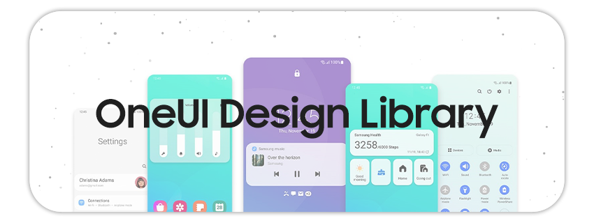
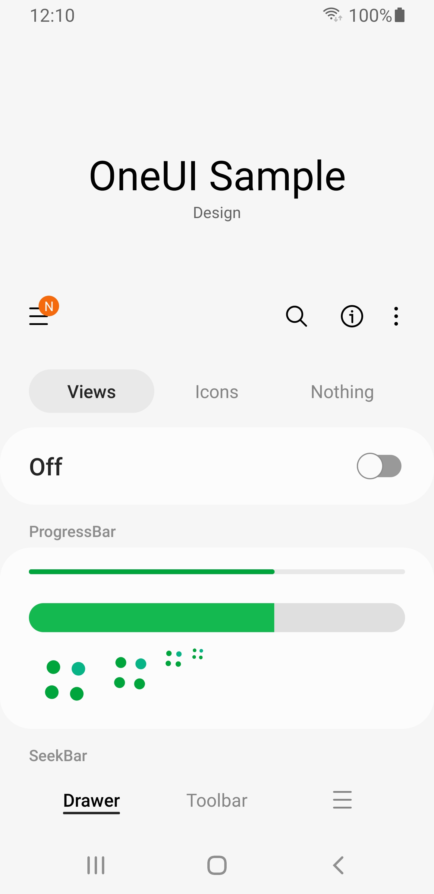
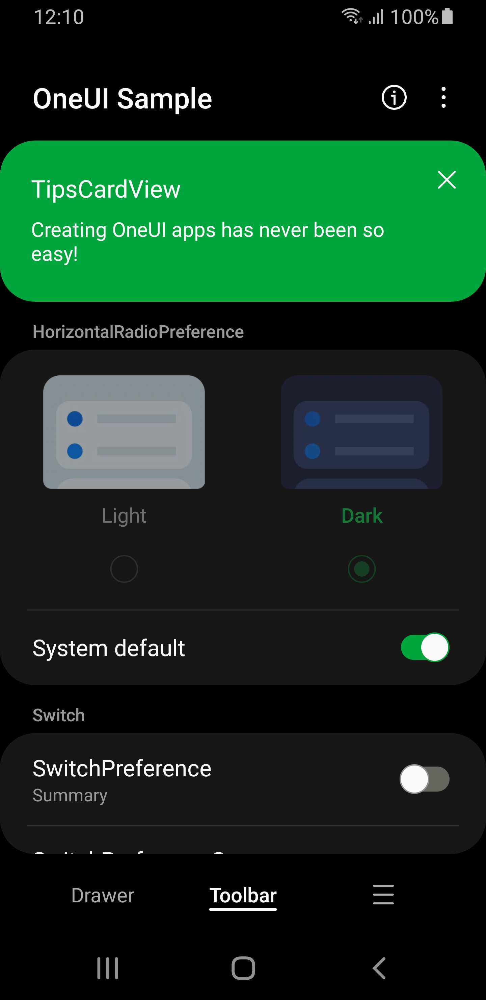
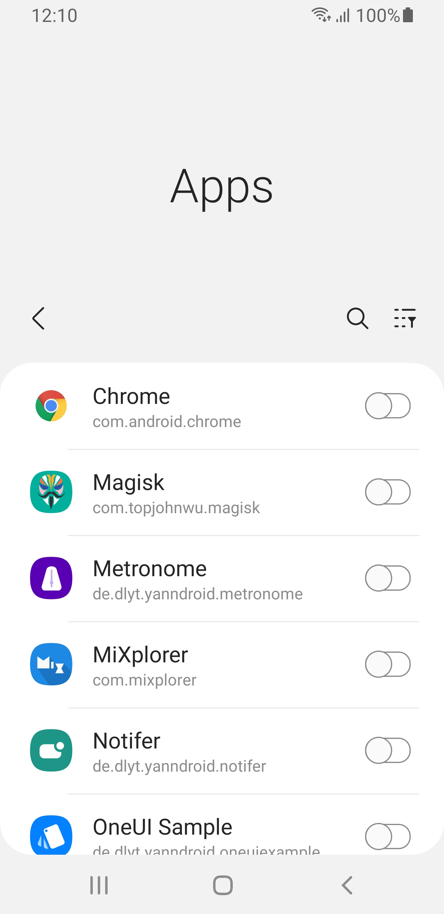
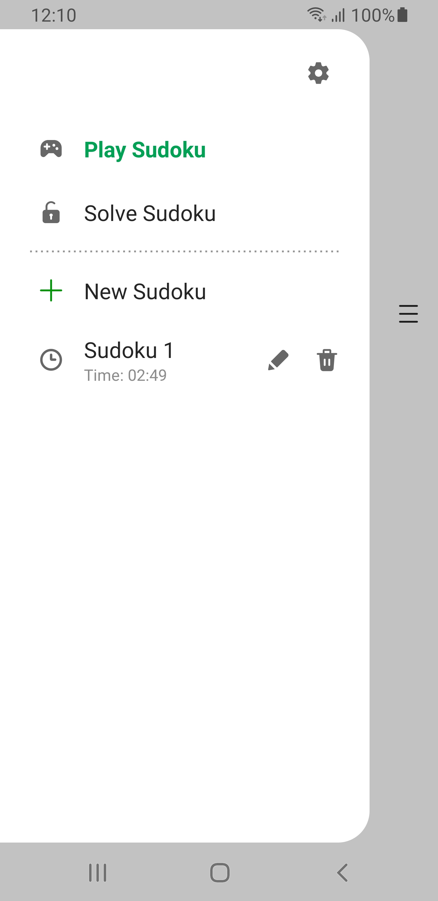

<p align="center">

</p>

<h2 align="center">

[](https://mvnrepository.com/artifact/io.github.yanndroid/oneui) [](https://forum.xda-developers.com/t/dev-library-5-0-oneui-design-library-2-2-1.4387485/) [](https://t.me/Yanndroid)

</h2>

 A library for Android, useful for creating Samsung's OneUI **3 and 4** styled apps. This library contains a theme which will apply for most views in your layout, and a lot of additional custom OneUI views. The text which is in the custom views is translated to 90 languages, so you don't need to worry about these. Android 5.0 (api 21) and above are supported, the library also supports Dark mode, Landscape, Tablet, DeX and RTL. This library has been tested in Android Studio, but should work in other IDEs too. You can download and install the latest sample app apk [here](https://github.com/Yanndroid/OneUI-Design-Library/raw/master/app/release/app-release.apk) and also check out my other apps for some more examples on how to use this library. Suggestions, improvements and help are always welcome.

Huge thanks to [BlackMesa123](https://github.com/BlackMesa123) who has contributed a lot to this project.

- [Installation](#Installation)
- [Documentation](../../wiki)
- [More info](#More-info)
- [Special thanks](#Special-thanks-to)

<p align="center">   </p>

[GIF version](https://github.com/Yanndroid/OneUI-Design-Library/blob/master/readme-resources/screenshots/screenrecording.gif)

## Installation

1. Add the dependency
```gradle
implementation 'io.github.yanndroid:oneui:2.2.1'
```
2. Apply the main theme in AndroidManifest.xml
```xml
<application
    ...
    android:theme="@style/OneUITheme" >
    ...
</application>
```

3. Read the [Documentation](../../wiki)

</br>

## More info
- [Official OneUI Design Guide](https://design.samsung.com/global/contents/one-ui/download/oneui_design_guide_eng.pdf)
- [Samsung's EULA](https://www.samsung.com/sg/Legal/SamsungLegal-EULA/)
- [Optimizing for DeX](https://developer.samsung.com/samsung-dex/modify-optimizing.html)

</br>

## Special thanks to:
- [Samsung](https://www.samsung.com/) for their awesome OneUI Design. :)
- [BlackMesa123](https://github.com/BlackMesa123) for a lot of OneUI stuff, more compatibility and his experience.
- [TenSeventy7](https://github.com/TenSeventy7) for some stuff and help.
- [leonbcode](https://github.com/leonbcode) for github actions, so this library is always up-to-date.
- All the [Contributors](https://github.com/Yanndroid/OneUI-Design-Library/graphs/contributors) and Issue Reporters.
