[](https://github.com/Yanndroid/OneUI-Design-Library/releases)
[](https://github.com/Yanndroid/OneUI-Design-Library/raw/master/app/release/app-release.apk)

[](https://github.com/Yanndroid/OneUI-Design-Library/issues)
[](https://github.com/Yanndroid/OneUI-Design-Library/pulls)
[](https://github.com/Yanndroid/OneUI-Design-Library/network/members)
[](https://github.com/Yanndroid/OneUI-Design-Library/graphs/contributors)
[](https://t.me/Yanndroid)

# OneUI Design

:warning: v1.3.0: moved from ```de.dlyt.yanndroid.samsung``` to ```de.dlyt.yanndroid.oneui```

A library for Android, which makes your app look like Samsung's OneUI 3. In this library, there is a theme which will apply for each view (see [Progress](#Progress)) in your layout. Of course it also has dark mode and even landscape/dex support. The text which is in the custom views is translated to 90 languages, so you don't need to worry for these. This library has been tested in AndroidStudio, but should work in other IDEs too. You can try out the latest example [here](https://github.com/Yanndroid/OneUI-Design-Library/raw/master/app/release/app-release.apk). Suggestions, improvements and help are always welcome.

Excuse my bad english, feel free to correct it. :)


- [Screenshots](#Screenshots)
- [Installation](#Installation)
- [Usage](#Usage)
  - [DrawerLayout](#DrawerLayout)
  - [ToolbarLayout](#ToolbarLayout)
  - [OptionButton](#OptionButton)
  - [OptionGroup](#OptionGroup)
  - [DrawerDivider](#DrawerDivider)
  - [SplashViewSimple](#SplashViewSimple)
  - [SplashViewAnimated](#SplashViewAnimated)
  - [AboutPage](#AboutPage)
  - [SwitchBar](#SwitchBar)
  - [RelatedCard](#RelatedCard)
  - [SeekBar](#SeekBar)
  - [ProgressBar](#ProgressBar)
  - [Button](#Button)
  - [ColorPickerDialog](#ColorPickerDialog)
  - [Icons](#Icons)
  - [Color theme](#Color-theme)
    - [Entire App](#1-entire-App)
    - [Single/Multiple activities](#2-singleMultiple-activities)
    - [Via Code](#3-Via-Code)
  - [App Icon](#App-Icon)
  - [Advanced](#Advanced)
- [Progress](#Progress)
- [Changelog](#Changelog)


## Screenshots
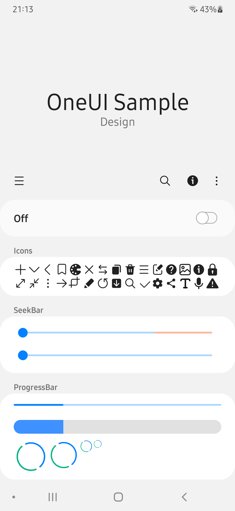 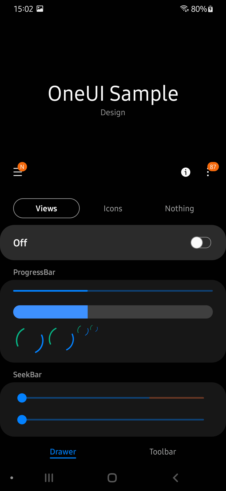 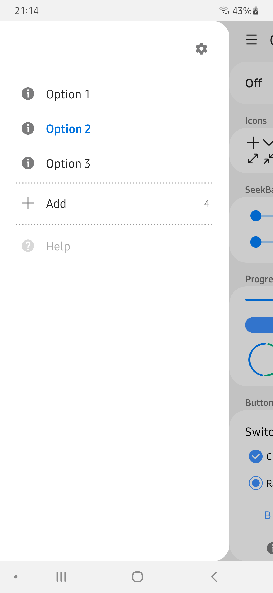 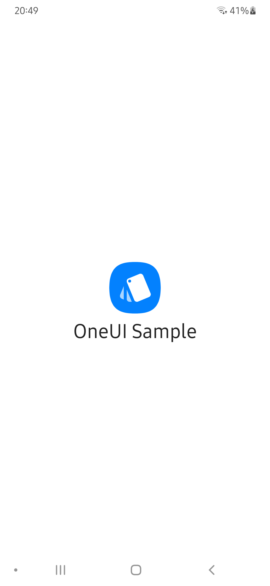 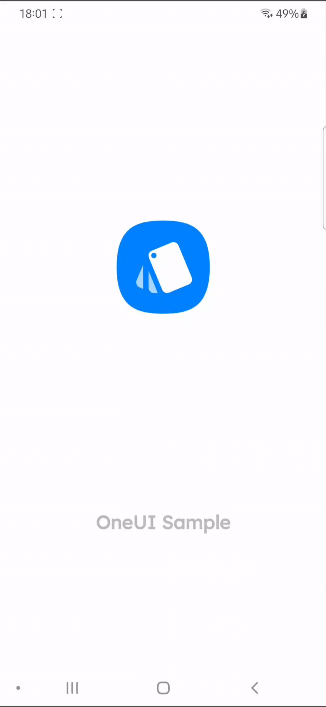  
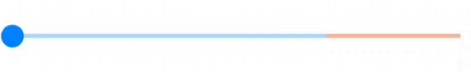  
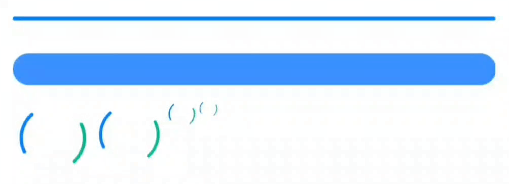  
  


## Installation
### with [Jitpack](https://jitpack.io/#Yanndroid/SamsungOneUi):
1. Add jitpack to build.gradle (Project: ...)
```gradle
allprojects {
    repositories {
        ...
        maven { url 'https://jitpack.io' }
	}
}
```
2. Add the dependency to build.gradle (Module: ...)
```gradle
dependencies {
	implementation 'com.github.Yanndroid:OneUI-Design-Library:1.3.0'
    ...
}
```
3. Apply the theme in AndroidManifest.xml
```xml
<application
    ...
    android:theme="@style/SamsungTheme"
    >
    ...
</application>
```


### with Github Packages:
1. Create a [new token](https://github.com/settings/tokens) with ```read:packages``` permission.
2. Add the dependency to build.gradle (Module: ...)
```gradle
repositories {
    maven {
        url = uri("https://maven.pkg.github.com/Yanndroid/OneUI-Design-Library")
            credentials {
                username = "your username"
                password = "your token"
            }
    }
}


dependencies {
    implementation 'de.dlyt.yanndroid:oneui:1.3.0'
    ...
}
```

3. Apply the theme in AndroidManifest.xml
```xml
<application
    ...
    android:theme="@style/SamsungTheme"
    >
    ...
</application>
```

## Usage
In general, most of the views (see [Progress](#Progress)) are styled automatically when you set ```android:theme="@style/SamsungTheme"``` in AndroidManifest.xml.

### DrawerLayout
"Ready-to-go" DrawerLayout with collapsing toolbar.
```xml
<de.dlyt.yanndroid.oneui.layout.DrawerLayout 
    android:layout_width="match_parent"
    android:layout_height="match_parent"
    app:drawer_icon="..."
    app:drawer_viewId="@id/viewInDrawer"
    app:toolbar_subtitle="..."
    app:toolbar_title="..."
    app:toolbar_expanded="..."
    app:toolbar_expandable="...">

    <View
        android:id="@+id/viewInDrawer"
        ... />

    <!--other views-->

</de.dlyt.yanndroid.oneui.layout.DrawerLayout>

```
The view with the ID specified in ```app:drawer_viewId="..."``` will be shown in the drawer and the rest of the children on the main screen.  

```app:toolbar_title="..."``` and ```app:toolbar_subtitle="..."``` are setting the title and subtitle in the toolbar. The toolbar is expandable by default, it can be changed with ```app:toolbar_expandable="..."```. If you only want it to be collapsed, you can use ```app:toolbar_expanded="..."``` instead.  

The drawable in ```app:drawer_icon="..."``` is the little icon at the top right in the drawer pane. There are already some stock Samsung [icons](#Icons) included in the library.  

If you want the toolbar collapsing when you scroll the content you should either use a [NestedScrollView](https://developer.android.com/reference/androidx/core/widget/NestedScrollView) as view child or set ```android:nestedScrollingEnabled="true"``` on the view you want the toolbar to collapse on scroll.

#### Methods
Return the toolbar, useful for ```setSupportActionBar()```.
```java
public Toolbar getToolbar()
```
OnClickListener for the DrawerIcon (the icon in the top right corner of the drawer pane).
```java
public void setDrawerIconOnClickListener(OnClickListener listener)
```
Set the title of the toolbar.
```java
public void setToolbarTitle(String title)
```
Set the subtitle of the toolbar.
```java
public void setToolbarSubtitle(String subtitle)
```
Set the subtitle color of the toolbar.
```java
public void setToolbarSubtitleColor(int color)
```
Expand or collapse the toolbar with an optional animation.
```java
public void setToolbarExpanded(boolean expanded, boolean animate)
```
Set the toolbar expandable.
```java
public void setToolbarExpandable(boolean expandable)
```
Show/hide the badges on the DrawerIcon and NavigationIcon.
```java
public void showIconNotification(boolean navigationIcon, boolean drawerIcon)
```
Open/close the drawer pane with an optional animation.
```java
public void setDrawerOpen(Boolean open, Boolean animate)
```

### ToolbarLayout
Basically the same as [DrawerLayout](#DrawerLayout) but without the drawer.
```xml
<de.dlyt.yanndroid.oneui.layout.ToolbarLayout
    android:layout_width="match_parent"
    android:layout_height="match_parent"
    app:title="..."
    app:subtitle="..."
    app:navigationIcon="..."
    app:expanded="..."
    app:expandable="..."
    >

    <!--children-->

</de.dlyt.yanndroid.oneui.layout.ToolbarLayout>
```
```app:navigationIcon="..."``` is the NavigationIcon of the toolbar. There are already some stock Samsung [icons](#Icons) included in the library, like a drawer and back icon.  

The toolbar is expandable by default, it can be changed with ```app:expandable="..."```.. If you only want it to be collapsed, you can use ```app:expanded="..."``` instead.  

Same as the [DrawerLayout](#DrawerLayout) you need to use a [NestedScrollView](https://developer.android.com/reference/androidx/core/widget/NestedScrollView) or ```android:nestedScrollingEnabled="true"```.

#### Methods
Return the toolbar, useful for ```setSupportActionBar()```.
```java
public Toolbar getToolbar()
```
Set the title of the toolbar.
```java
public void setTitle(String title)
```
Set the subtitle of the toolbar.
```java
public void setSubtitle(String subtitle)
```
Set the subtitle color.
```java
public void setSubtitleColor(int color)
```
Expand or collapse the toolbar with an optional animation.
```java
public void setExpanded(boolean expanded, boolean animate)
```
Set the toolbar expandable.
```java
public void setExpandable(boolean expandable)
```
OnClickListener for the NavigationIcon (Back icon).
```java
public void setNavigationOnClickListener(OnClickListener listener)
```
Show/hide the badges on the NavigationIcon.
```java
public void showNavIconNotification(boolean showNotification)
```
Set a drawable for the NavigationIcon.
```java
public void setNavigationIcon(Drawable navigationIcon)
```

### OptionButton
These are the buttons you can see in the drawer of Samsung apps.

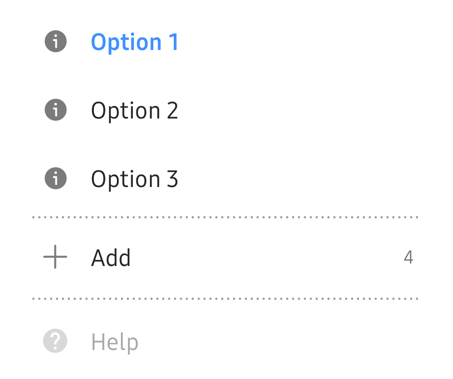

```xml
<de.dlyt.yanndroid.oneui.drawer.OptionButton
    android:layout_width="match_parent"
    android:layout_height="wrap_content"
    app:icon="..."
    app:text="..."
    app:selected="..."
    app:counter="..."
    app:counterEnabled="..." />
```

```app:icon="..."``` the drawable icon and ```app:text="..."``` the text. ```app:selected="..."``` is to show the OptionButton as selected (colored, bold text), it's false by default. ```app:counterEnabled="..."``` and ```app:counter="..."``` are there for the counter, which is disabled by default. If you only set ```app:counter="..."``` it still will be hidden. You don't need to add all attributes.

#### Methods
Set/get the icon and text.
```java
public String getText()
public void setText(String text)

public void setIcon(Drawable icon)
```
Manage the counter.
```java
public Integer getCounter()
public void setCounter(Integer integer)
public void setCounterEnabled(Boolean enabled)
public void toggleCounterEnabled()
public Boolean isCounterEnabled()
```
Control the state (colored, bold text).
```java
public void setButtonSelected(Boolean selected)
public void toggleButtonSelected()
public Boolean isButtonSelcted()
```
Enable/disable the OptionButton.
```java
public void setButtonEnabled(Boolean enabled)
```


### OptionGroup
[OptionButton](#OptionButton) and OptionGroup are working together like [RadioButton](https://developer.android.com/reference/android/widget/RadioButton) and [RadioGroup](https://developer.android.com/reference/android/widget/RadioGroup). It will select (colored, bold text) a OptionButton on click.


```xml
<de.dlyt.yanndroid.oneui.drawer.OptionGroup
    android:id="@+id/optiongroup"
    android:layout_width="match_parent"
    android:layout_height="wrap_content"
    app:selectedOptionButton="@id/ob1">

    <de.dlyt.yanndroid.oneui.drawer.OptionButton
        android:id="@+id/ob1"
        android:layout_width="match_parent"
        android:layout_height="wrap_content"
        app:icon="@drawable/ic_samsung_info"
        app:text="Option 1" />

    <de.dlyt.yanndroid.oneui.drawer.OptionButton
        android:id="@+id/ob2"
        android:layout_width="match_parent"
        android:layout_height="wrap_content"
        app:icon="@drawable/ic_samsung_info"
        app:text="Option 2" />

    <de.dlyt.yanndroid.oneui.drawer.OptionButton
        android:id="@+id/ob3"
        android:layout_width="match_parent"
        android:layout_height="wrap_content"
        app:icon="@drawable/ic_samsung_info"
        app:text="Option 3" />

</de.dlyt.yanndroid.oneui.drawer.OptionGroup>
```

```app:selectedOptionButton="..."``` will select (colored, bold text) the OptionButton with this id. This view can also have other children, for example [DrawerDivider](#DrawerDivider).

#### Methods
Select an OptionButton with either the view, id or position.
```java
public void setSelectedOptionButton(OptionButton optionButton)
public void setSelectedOptionButton(Integer id)
public void setSelectedOptionButton(int position)
```
Get the currently selected OptionButton.
```java
public OptionButton getSelectedOptionButton()
```
Listener which will provide you view, id and position of the clicked OptionButton.
```java
public void setOnOptionButtonClickListener(OnOptionButtonClickListener listener)
```

### DrawerDivider
A divider between the [OptionButtons](#OptionButton) on the drawer. It's the same divider you can find in almost any Samsung app drawer.


```xml
<de.dlyt.yanndroid.oneui.drawer.Divider
    android:layout_width="match_parent"
    android:layout_height="4dp"
    android:layout_marginHorizontal="24dp"
    android:layout_marginVertical="2dp" />
```
Alternatively you could use this, it's easier and all set but less customizable:
```xml
<View style="@style/DrawerDividerStyle" />
```

### SplashViewSimple
Simple Splash view. (I think Samsung removed the splashscreen of their apps since OneUI 3 but in former times it was still there.) Add this ```android:theme="@style/SamsungSplashTheme"``` to your splash activity in AndroidManifest.


```xml
<de.dlyt.yanndroid.oneui.layout.SplashViewSimple
    android:layout_width="match_parent"
    android:layout_height="match_parent"
    app:image="..."
    app:text="..." />
```
```app:image="..."```is the icon and ```app:text="..."``` the text underneath the icon.

#### Methods
Sets the icon drawable
```java
public void setImage(Drawable mImage)
```
Sets the text of the splash textview
```java
public void setText(String mText)
```
Returns the text of the splash textview
```java
public String getText()
```


### SplashViewAnimated
An animated splash screen view like the one in the GalaxyStore. Add this ```android:theme="@style/SamsungSplashTheme"``` to your splash activity in AndroidManifest.


```xml
<de.dlyt.yanndroid.oneui.layout.SplashViewAnimated
    android:layout_width="match_parent"
    android:layout_height="match_parent"
    app:background_image="..."
    app:foreground_image="..."
    app:animation="..."
    app:text="..." />
```

```app:background_image="..."``` only the background of your icon and ```app:foreground_image="..."``` only the foreground, which will have a shake animation.
```app:text="..."``` will be the text under the icon. It has a very similar font and color as the GalaxyStore splash text.

The default animation will be like the one of the galaxy store but you can change this with ```app:animation="@anim/..."``` if you want to use your own.

#### Methods
Sets the icon fore- and background
```java
public void setImage(Drawable foreground, Drawable background)
```
Sets the text of the splash textview
```java
public void setText(String mText)
```
Returns the text of the splash textview
```java
public String getText()
```
Starts the shake animation of the foreground
```java
public void startSplashAnimation()
```
Clears the animation
```java
public void clearSplashAnimation()
```
Listener for the splash animation
```java
public void setSplashAnimationListener(Animation.AnimationListener listener)
```

### AboutPage
A layout that looks like and has the same functions as the about screen in any Samsung app.

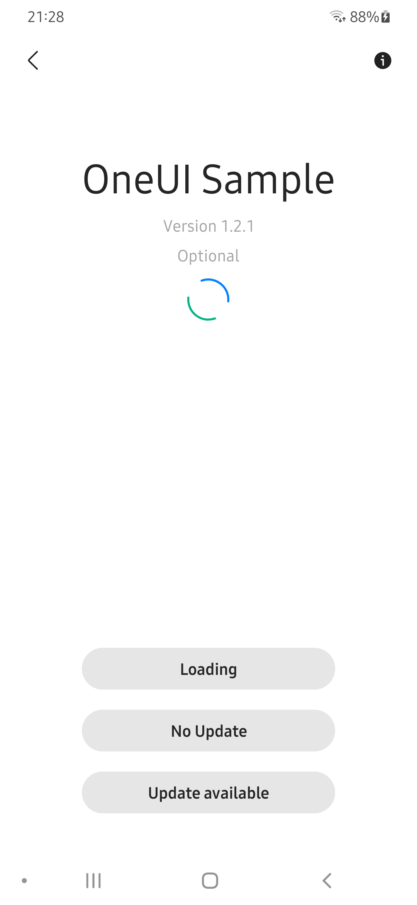 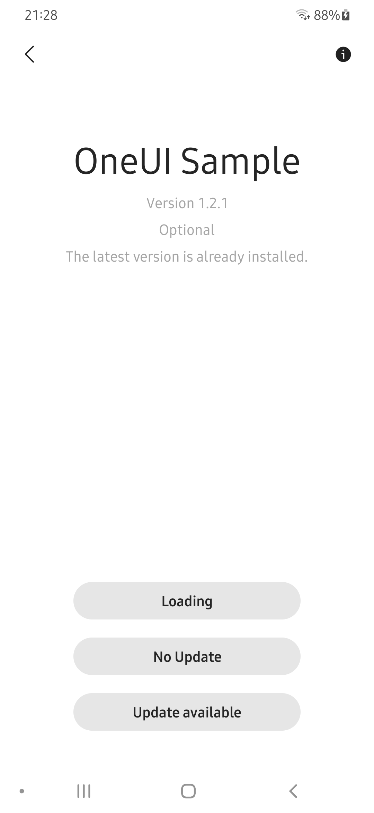 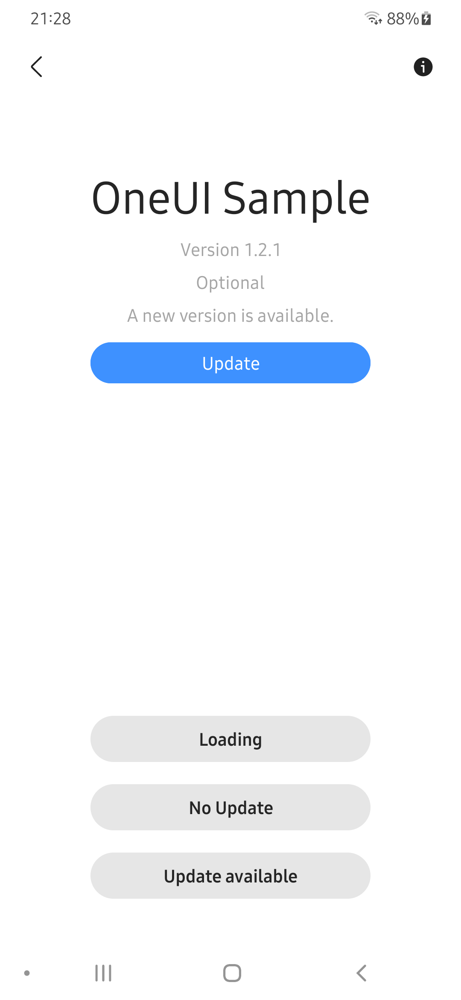

```xml
<de.dlyt.yanndroid.oneui.layout.AboutPage
    android:layout_width="match_parent"
    android:layout_height="match_parent"
    app:optional_text="...">

    <com.google.android.material.button.MaterialButton
        style="@style/ButtonStyle.AboutPage"
        android:text="..." />


</de.dlyt.yanndroid.oneui.layout.AboutPage>
```
The app name and version are automatically added to the view. The info icon at the top right will redirect the user to the app info in settings. The ```app:optional_text="..."``` is the text between the version and the status text. The status text will change according to the state you set the view (see below). You can use ```style="@style/ButtonStyle.AboutPage"``` for the buttons, which are shown at the bottom.

#### Methods
Set the update state of the view to either ```AboutPage.LOADING```, ```AboutPage.NO_UPDATE``` or ```AboutPage.UPDATE_AVAILABLE```. This will change the visibility of certain views and the text of the Status.
```java
public void setUpdateState(@UpdateState int state)
```
Set the optional text between the version and the status text.
```java
public void setOptionalText(String text)
```
OnClickListener for the update button.
```java
public void setUpdateButtonOnClickListener(OnClickListener listener)
```

### SwitchBar
A SwitchBar like in the wifi or bluetooth settings.


```xml
<de.dlyt.yanndroid.oneui.SwitchBar
    android:layout_width="match_parent"
    android:layout_height="wrap_content" />
```
#### Methods
On and Off text of the Switchbar.
```java
public void setSwitchBarText(int i, int i2)
```
Enable and disable the Switchbar.
```java
public void setEnabled(boolean z)
```
Visibility of the ProgressBar in the Switchbar.
```java
public void setProgressBarVisible(boolean z)
```
Switchbar Listener.
```java
public void addOnSwitchChangeListener(OnSwitchChangeListener onSwitchChangeListener)
```

### RelatedCard
It's like the "Looking for something else?" card in settings.

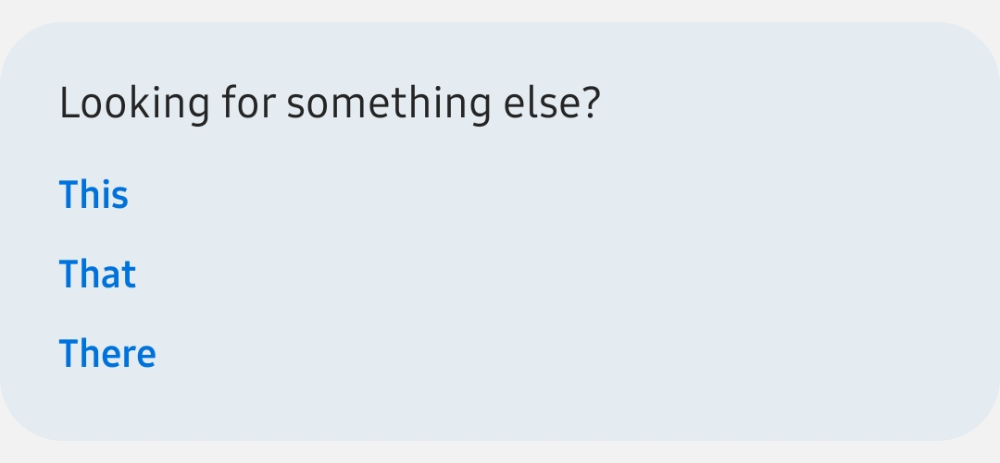  

(Depending on your screen right now you might not see it, but there's actually a light blue card around it.)

```xml
<de.dlyt.yanndroid.oneui.RelatedCard
    android:layout_width="match_parent"
    android:layout_height="wrap_content"
    app:title="...">

    <com.google.android.material.textview.MaterialTextView
        style="@style/RelatedButtonStyle"
        android:text="..." />


</de.dlyt.yanndroid.oneui.RelatedCard>
```
You can simply use ```style="@style/RelatedButtonStyle"``` for the child TextViews.

#### Methods
Get/set the title text.
```java
public String getTitle()
public void setTitle(String title)
```


### SeekBar
A Seekbar like the brightness slider in the QS.


```xml
<de.dlyt.yanndroid.oneui.SeekBar
    android:layout_width="match_parent"
    android:layout_height="wrap_content"
    app:seslSeekBarMode="expand" />
```
If you don't want/need the expanding seekbar, you can use the default seekbar instead, as the style will also apply on this one.

#### Methods
Set a warning at progress i.
```java
public void setOverlapPointForDualColor(int i)
```
Other methodes are the same as the normal [Seekbar](https://developer.android.com/reference/android/widget/SeekBar).

### ProgressBar
The theme won't apply for the ProgressBar, so you need to set it manually:


```style="@style/ProgressBarStyle.Horizontal"```  
```style="@style/ProgressBarStyle.Horizontal.Large"```  
```style="@style/ProgressBarStyle.Circle.Large"```  
```style="@style/ProgressBarStyle.Circle"```  
```style="@style/ProgressBarStyle.Circle.Small"```  
```style="@style/ProgressBarStyle.Circle.Title"```

### Button


The first style is applied by default. The other two can be used with ```style="@style/ButtonStyle.Invert"``` and ```style="@style/ButtonStyle.Invert.Secondary"```.

### ColorPickerDialog
A color picker dialog like in Samsung Notes.

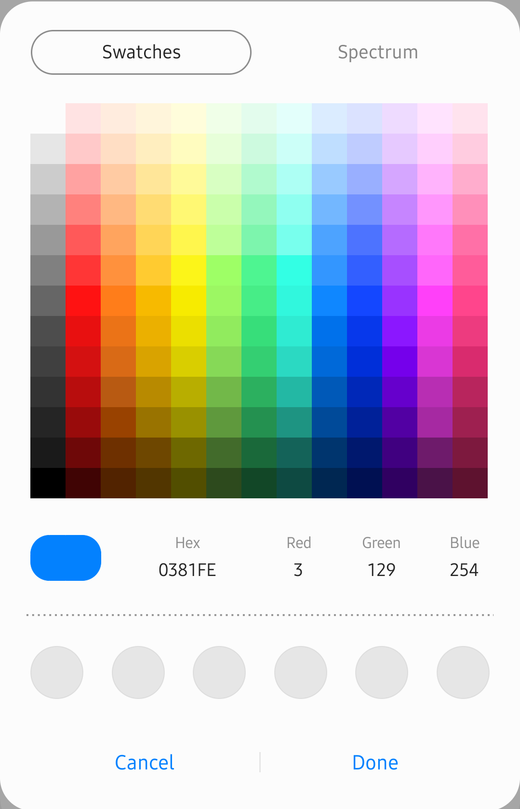 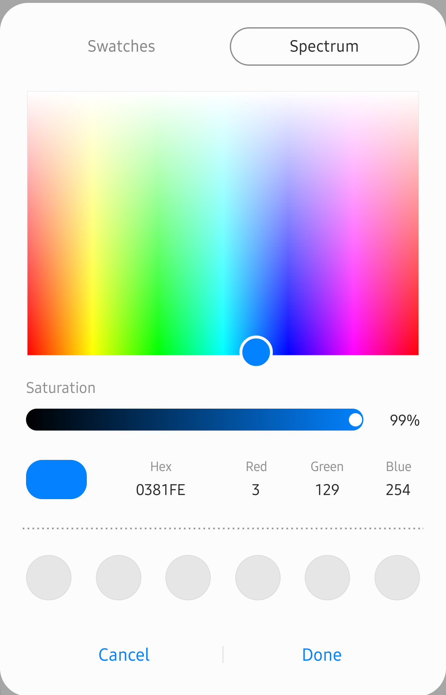

Create dialog with mode (1 = Spectrum, 2 = Swatches) and fArr (starting color).
```java
public ColorPickerDialog(Context context, int mode, float[] fArr)
public ColorPickerDialog(Context context, float[] fArr)
```
Show the dialog.
```java
public void show()
```
Dismiss the dialog.
```java
public void dismiss()
```
Close the dialog.
```java
public void close()
```
Listener when "Done" is pressed.
```java
public void setColorPickerChangeListener(ColorPickerChangedListener colorPickerChangedListener)
```
Example:
```java
float[] scolor = new float[3];
Color.colorToHSV(Color.parseColor("#0381fe5"), scolor);

ColorPickerDialog mColorPickerDialog = new ColorPickerDialog(this, scolor);
mColorPickerDialog.setColorPickerChangeListener(new ColorPickerDialog.ColorPickerChangedListener() {
    @Override
    public void onColorChanged(int i, float[] fArr) {
        
    }

    @Override
    public void onViewModeChanged(int i) {

    }
});
mColorPickerDialog.show();
```

### Icons
There are also some of the stock icons you can find in Samsung apps included in this library, and I will add more over time. You can use them with ```@drawable/ic_samsung_...``` and ```R.drawable.ic_samsung_...```.


<details>
<summary>See the icon list</summary>


```ic_samsung_arrow_down```  
```ic_samsung_arrow_left```  
```ic_samsung_arrow_right```  
```ic_samsung_arrow_up```  
```ic_samsung_attach```  
```ic_samsung_audio```  
```ic_samsung_back```  
```ic_samsung_book```  
```ic_samsung_bookmark```  
```ic_samsung_brush```  
```ic_samsung_camera```  
```ic_samsung_close```  
```ic_samsung_convert```  
```ic_samsung_copy```  
```ic_samsung_delete```  
```ic_samsung_document```  
```ic_samsung_download```  
```ic_samsung_drawer```  
```ic_samsung_edit```  
```ic_samsung_equalizer```  
```ic_samsung_favorite```  
```ic_samsung_group```  
```ic_samsung_help```  
```ic_samsung_image```  
```ic_samsung_image_2```  
```ic_samsung_import```  
```ic_samsung_info```  
```ic_samsung_keyboard```  
```ic_samsung_lock```  
```ic_samsung_mail```  
```ic_samsung_maximize```  
```ic_samsung_minimize```  
```ic_samsung_minus```  
```ic_samsung_more```  
```ic_samsung_move```  
```ic_samsung_mute```  
```ic_samsung_page```  
```ic_samsung_pause```  
```ic_samsung_pdf```  
```ic_samsung_pen```  
```ic_samsung_pen_calligraphy```  
```ic_samsung_pen_calligraphy_brush```  
```ic_samsung_pen_eraser```  
```ic_samsung_pen_fountain```  
```ic_samsung_pen_marker```  
```ic_samsung_pen_marker_round```  
```ic_samsung_pen_pencil```  
```ic_samsung_play```  
```ic_samsung_plus```  
```ic_samsung_rectify```  
```ic_samsung_redo```  
```ic_samsung_remind```  
```ic_samsung_rename```  
```ic_samsung_reorder```  
```ic_samsung_restore```  
```ic_samsung_save```  
```ic_samsung_scan```  
```ic_samsung_search```  
```ic_samsung_selected```  
```ic_samsung_send```  
```ic_samsung_settings```  
```ic_samsung_share```  
```ic_samsung_shuffle```  
```ic_samsung_smart_view```  
```ic_samsung_stop```  
```ic_samsung_tag```  
```ic_samsung_text```  
```ic_samsung_text_2```  
```ic_samsung_time```  
```ic_samsung_undo```  
```ic_samsung_unlock```  
```ic_samsung_voice```  
```ic_samsung_volume```  
```ic_samsung_warning```  
```ic_samsung_web_search.xml```  

</details>
&nbsp;

### Color theme
The default color of the style is the same blue as Samsung (see [Screenshots](#Screenshots)). But like Samsung has different colors for different apps, you too can use other colors which will apply on the entire App and even on the [App Icon](#App-Icon). In this library there are there are three different ways to do that and all three can be used simultaneously:

#### 1. Entire App
This methode will apply the color theme on the entire app and on the app icon. You need to add these three colors in your ```colors.xml``` :
```xml
<color name="primary_color">...</color>
<color name="secondary_color">...</color>
<color name="primary_dark_color">...</color>
```
These colors should have approximately the same color but with a different brightness. ```secondary_color``` the brightest, then ```primary_color``` and the darkest ```primary_dark_color```.  

Here are some presets (if you want I can make more):
-  Yellow like MyFiles App (also used in [FreshHub](https://github.com/Yanndroid/FreshHub)):
```xml
<color name="primary_color">#fff3a425</color>
<color name="secondary_color">#ffffb949</color>
<color name="primary_dark_color">#ffbd7800</color>
```

-  Dark green like Calendar App:
```xml
<color name="primary_color">#ff008577</color>
<color name="secondary_color">#ff009e7c</color>
<color name="primary_dark_color">#ff00574b</color>
```

-  Light green like Calculator App:
```xml
<color name="primary_color">#ff68b31a</color>
<color name="secondary_color">#ff7fa87f</color>
<color name="primary_dark_color">#ff569415</color>
```

-  Light red which I personally like:
```xml
<color name="primary_color">#ffff034a</color>
<color name="secondary_color">#ffff3d67</color>
<color name="primary_dark_color">#ffde0043</color>
```

#### 2. Single/Multiple activities
If you want to use different colors for a single (or multiple, but not all) activities, this is also possible. The difference here is that this will only apply for the activities you want. Add the three colors (see [Entire App](#1.-Entire-App)) in a theme in ```themes.xml```:

```xml
<style name="ThemeName" parent="SamsungTheme">
    <item name="colorPrimary">#fff3a425</item>
    <item name="colorSecondary">#ffffb949</item>
    <item name="colorPrimaryDark">#ffbd7800</item>
</style>
```
Then apply it on the activities you want with ```android:theme="@style/ThemeName"``` in ```AndroidManifest.xml```.

#### 3. Via Code
This methode allows you to change the color of your theme dynamically within your app. It's based on [this idea](https://stackoverflow.com/a/48517223). In your activity onCreate add this line at the top **before** ```setContentView(...)```:
```java
new ThemeColor(this);
```
This will apply the color theme at launch. If you want to change the color you can use these functions:
```java
ThemeColor.setColor(Activity activity, int red, int green, int blue)
ThemeColor.setColor(Activity activity, float red, float green, float blue)
ThemeColor.setColor(Activity activity, float[] hsv)
```
The color you apply with these functions will apply on every activity with ```new ThemeColor(this)``` at the top.

### App Icon
The most app icons of Samsung apps are made of one solid color as background and a white icon as foreground. Usually there is even a little detail of the foreground with a similar color as the background.

                  

 I would suggest you to use ```@color/primary_color``` for the background color and either ```@color/launcher_foreground_detail_color``` , ```@color/secondary_color``` or ```@color/primary_dark_color``` for the foreground "detail" color, so [your color theme](#Color-theme) applies for the app icon too.  
My sample app icon for example:


### Advanced
This is for further customization. I added the methode ```getView(int view)``` to some of the custom view to access the views inside it and change them directly. This can be helpful if you want to do something which isn't implemented in the custom views yet as I can't think of all possible uses. Currently this methode is available in OptionButton, AboutPage, DrawerLayout, ToolbarLayout and SplashView (both).

## Progress

- [x] CardView
- [x] Checkbox
- [x] Switch 
- [x] Radiobutton
- [x] Progressbar circle
- [x] Progressbar horizontal
- [x] Seekbar
- [x] Drawer
- [x] Drawer divider
- [x] SeslToggleSwitch
- [x] SeslProgressbar
- [x] SeslSwitchBar
- [x] SeslSeekbar
- [x] Collapsing toolbar
- [x] Rtl
- [x] Landscape support
- [x] Tablet support
- [x] About screen
- [x] Related card
- [x] Button
- [x] Scrollbar
- [x] Desktop support (DeX) *
- [x] Color picker dialog *
- [x] Spinner *
- [ ] Menu *
- [ ] SnackBar *
- [ ] Dialog *
- [ ] BottomSheet
- [ ] TabLayout & Viewpager
- [ ] Preferences
- [ ] SearchView
- [ ] Tooltip
- [ ] Progress dialog
- [ ] Bottom navigation
- [ ] (Textview)
- [ ] (Edittext)

*needs improvement

## Changelog

<details>
<summary>1.3.0</summary>

- renamed library
- getView methode added
- splash screen display size fix
- minor changes

</details>

<details>
<summary>1.2.2</summary>

- Scrollbar
- AboutPage
- RelatedCard
- corner fix
- language update
- customizable splash animation
- expanded attribute for toolbar
- fixed landscape toolbar height
- improved orientation switching
- button text fix
- status & navigation bar dim on drawer slide
- added changelog to readme

</details>

<details>
<summary>1.2.1</summary>

- landscape support
- tablet support
- dex support
- expandable attribute for toolbar
- toolbar subtitle color
- added Header style

</details>

<details>
<summary>1.2.0</summary>

- colorPicker
- color Changer
- readme finished
- much more icons
- rtl support
- translated to 90 languages

</details>

<details>
<summary>1.1.3 - 1.0.0</summary>

- initial release/publish
- most of the stuff (I don't remember anymore...)

</details>
&nbsp;

## More info
- [Official OneUI Design Guide](https://design.samsung.com/global/contents/one-ui/download/oneui_design_guide_eng.pdf)


## Special thanks to:
- [BlackMesa123](https://github.com/BlackMesa123) for a lot of OneUI stuff, more compatibility and his experience.
- [leonbcode](https://github.com/leonbcode) for github actions, so this library is always up-to-date.
- [AlirezaIvaz](https://github.com/AlirezaIvaz) for translation correction (Persian) and issue reporting.
- [nfauv2001](https://github.com/nfauv2001) for helping me out with my english.
