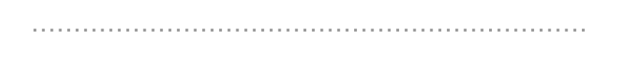
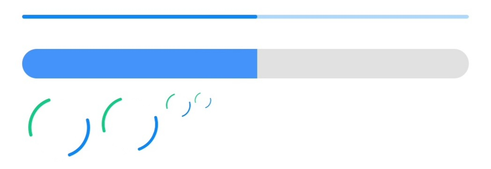
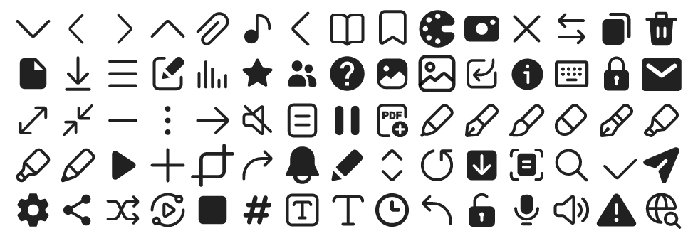

[](https://github.com/Yanndroid/SamsungOneUi/releases)
[](https://github.com/Yanndroid/SamsungOneUi/raw/master/app/release/app-release.apk)

[](https://github.com/Yanndroid/SamsungOneUi/issues)
[](https://github.com/Yanndroid/SamsungOneUi/pulls)
[](https://github.com/Yanndroid/SamsungOneUi/network/members)
[](https://github.com/Yanndroid/SamsungOneUi/graphs/contributors)
[](https://t.me/Yanndroid)


The Readme of this project isn't complete and will be updated.

# Samsung OneUi Design
A library for Android, which makes your app look like Samsung's OneUI. In this library there is a theme which will apply for each View (see [Progress](#Progress)) in your layout. This library has been tested in AndroidStudio, but should work in other IDEs too. You can try out the latest example [here](https://github.com/Yanndroid/SamsungOneUi/raw/master/app/release/app-release.apk).

Excuse my bad english, feel free to correct it. :)


- [Screenshots](#Screenshots)
- [Installation](#Installation)
- [Usage](#Usage)
  - [DrawerLayout](#DrawerLayout)
  - [ToolbarLayout](#ToolbarLayout)
  - [OptionButton and OptionGroup](#OptionButton-and-OptionGroup)
  - [DrawerDivider](#DrawerDivider)
  - [SplashViewSimple](#SplashViewSimple)
  - [SplashViewAnimated](#SplashViewAnimated)
  - [SwitchBar](#SwitchBar)
  - [SeekBar](#SeekBar)
  - [ProgressBar](#ProgressBar)
  - [Button](#Button)
  - [Icons](#Icons)
  - [Own custom color theme](#Own-custom-color-theme)
    - [Different colors for different activities](#Different-colors-for-different-activities)
  - [App Icon](#App-Icon)
- [Progress](#Progress)


## Screenshots
todo: add screenshots and videos/gifs


## Installation
### with [Jitpack](https://jitpack.io/#Yanndroid/SamsungOneUi):
1. Add jitpack to build.gradle (Project: ...)
```gradle
allprojects {
    repositories {
        ...
        maven { url 'https://jitpack.io' }
	}
}
```
2. Add the dependency to build.gradle (Module: ...)
```gradle
dependencies {
	implementation 'com.github.Yanndroid:SamsungOneUi:1.1.2'
    ...
}
```
3. Apply the theme in AndroidManifest.xml
```xml
<application
    ...
    android:theme="@style/SamsungTheme"
    >
    ...
</application>
```


### with Github Packages:
1. Create a [new token](https://github.com/settings/tokens) with ```read:packages``` permission.
2. Add the dependency to build.gradle (Module: ...)
```gradle
repositories {
    maven {
        url = uri("https://maven.pkg.github.com/yanndroid/SamsungOneUi")
            credentials {
                username = "your username"
                password = "your token"
            }
    }
}


dependencies {
    implementation 'de.dlyt.yanndroid:samsung:1.1.2'
    ...
}
```

3. Apply the theme in AndroidManifest.xml
```xml
<application
    ...
    android:theme="@style/SamsungTheme"
    >
    ...
</application>
```

## Usage
### DrawerLayout
"Ready-to-go" DrawerLayout with collapsing toolbar.
```xml
<de.dlyt.yanndroid.samsung.layout.DrawerLayout 
    android:id="@+id/drawer_layout"
    android:layout_width="match_parent"
    android:layout_height="match_parent"
    app:drawer_icon="..."
    app:drawer_viewId="@id/viewindrawer"
    app:toolbar_subtitle="..."
    app:toolbar_title="...">

    <View
        android:id="@+id/viewindrawer"
        ... />

    <!--other views-->

</de.dlyt.yanndroid.samsung.layout.DrawerLayout>

```
The view with the ID specified in ```app:drawer_viewId="..."``` will be shown in the drawer and the rest of the children on the main screen.  

```app:toolbar_title="..."``` and ```app:toolbar_subtitle="..."``` are setting the title and subtitle in the toolbar. If nothing is set for the subtitle, the toolbar will adjust the title position to match the space.  

The drawable in ```app:drawer_icon="..."``` is the little icon at the top right in the drawer pane. There are already some stock Samsung [icons](#Icons) included in the library.  

If you want the toolbar collapsing when you scroll the content you should either use a [NestedScrollView](https://developer.android.com/reference/androidx/core/widget/NestedScrollView) as view child or set ```android:nestedScrollingEnabled="true"``` on the view you want the toolbar to collapse on scroll.

#### Methods
```java
public Toolbar getToolbar()
```
Returns the toolbar, useful for ```setSupportActionBar()```.
```java
public void setDrawerIconOnClickListener(OnClickListener listener)
```
OnClickListener for the DrawerIcon (the icon in the top right corner of the drawer pane).
```java
public void setToolbarTitle(String title)
```
Sets the title of the toolbar.
```java
public void setToolbarSubtitle(String subtitle)
```
Sets the subtitle of the toolbar.
```java
public void setToolbarExpanded(boolean expanded, boolean animate)
```
Expand or collapse the toolbar with an optional animation.
```java
public void showIconNotification(boolean navigationIcon, boolean drawerIcon)
```
Show/hide the badges on the DrawerIcon and NavigationIcon.
```java
public void setDrawerOpen(Boolean open, Boolean animate)
```
Open/close the drawer pane with an optional animation.

### ToolbarLayout
Basically the same as [DrawerLayout](#DrawerLayout) but without the drawer.
```xml
<de.dlyt.yanndroid.samsung.layout.ToolbarLayout
    android:id="@+id/toolbar_layout"
    android:layout_width="match_parent"
    android:layout_height="match_parent"
    app:title="..."
    app:subtitle="..."
    app:navigationIcon="..."
    >

    <!--children-->

</de.dlyt.yanndroid.samsung.layout.ToolbarLayout>
```
```app:navigationIcon="..."``` is the NavigationIcon of the toolbar. There are already some stock Samsung [icons](#Icons) included in the library, like a drawer and back icon.  

Same as the [DrawerLayout](#DrawerLayout) you need to use a [NestedScrollView](https://developer.android.com/reference/androidx/core/widget/NestedScrollView) or ```android:nestedScrollingEnabled="true"```.


### OptionButton and OptionGroup
todo

### DrawerDivider
A divider between to options on the drawer. It's the same divider you can find in almost any Samsung app drawer.



```xml
<de.dlyt.yanndroid.samsung.drawer.Divider
        android:layout_width="match_parent"
        android:layout_height="4dp"
        android:layout_marginHorizontal="24dp"
        android:layout_marginVertical="2dp" />
```
Alternatively you could use this, it's easier and all set but less customizable:
```xml
<View style="@style/DrawerDividerStyle" />
```

### SplashViewSimple
Simple Splash view. (I think Samsung removed the splashscreen of their apps since OneUI 3 but in former times it was still there.)

```xml
<de.dlyt.yanndroid.samsung.layout.SplashViewSimple
        android:layout_width="match_parent"
        android:layout_height="match_parent"
        app:image="..."
        app:text="..." />
```
```app:image="..."```is the icon and ```app:text="..."``` the text underneath the icon.

#### Methods
```java
public void setImage(Drawable mImage)
```
Sets the icon drawable
```java
public void setText(String mText)
```
Sets the text of the splash textview
```java
public String getText()
```
Returns the text of the splash textview

### SplashViewAnimated
An animated splash screen view like the one in the GalaxyStore.

```xml
<de.dlyt.yanndroid.samsung.layout.SplashViewAnimated
        android:id="@+id/splash"
        android:layout_width="match_parent"
        android:layout_height="match_parent"
        app:background_image="..."
        app:foreground_image="..."
        app:text="..." />
```

```app:background_image="..."``` only the background of your icon and ```app:foreground_image="..."``` only the foreground, which will have a shake animation.
```app:text="..."``` will be the text under the icon. It has a very similar font and color as the GalaxyStore splash text.

#### Methods
```java
public void setImage(Drawable foreground, Drawable background)
```
Sets the icon fore- and background
```java
public void setText(String mText)
```
Sets the text of the splash textview
```java
public String getText()
```
Returns the text of the splash textview
```java
public void startSplashAnimation()
```
Starts the shake animation of the foreground
```java
public void clearSplashAnimation()
```
Clears the animation
```java
public void setSplashAnimationListener(Animation.AnimationListener listener)
```
Listener for the splash animation


### SwitchBar
A SwitchBar like in the wifi or bluetooth settings.

```xml
<de.dlyt.yanndroid.samsung.SwitchBar
        android:id="@+id/switchbar"
        android:layout_width="match_parent"
        android:layout_height="wrap_content" />
```

### SeekBar
todo

### ProgressBar
The theme won't apply for the ProgressBar, so you need to set it manually:
```style="@style/ProgressBarStyle.Horizontal"```  
```style="@style/ProgressBarStyle.Horizontal.Large"```  
```style="@style/ProgressBarStyle.Circle.Large"```  
```style="@style/ProgressBarStyle.Circle"```  
```style="@style/ProgressBarStyle.Circle.Small"```  
```style="@style/ProgressBarStyle.Circle.Title"```



### Button
todo


### Icons
How would a OneUI design look like without OneUI icons? Not like OneUI... Thats's why I also included some of the stock icons you can find in stock Samsung apps, and more will come. You can use them with ```@drawable/ic_samsung_...```.




### Own custom color theme
The default color of the style is the same blue as Samsung (see [Screenshots](#Screenshots)). But like Samsung has different colors for different apps, you too can use other colors which will apply on the entire App and even on the [App Icon](#App-Icon). To do that you need to add in your ```colors.xml``` these three colors:
```xml
<color name="primary_color">...</color>
<color name="secondary_color">...</color>
<color name="primary_dark_color">...</color>
```
These colors should have approximately the same color but with a different brightness. ```secondary_color``` the brightest, then ```primary_color``` and the darkest ```primary_dark_color```.  

Here are some presets, if you want I can make more:
-  Yellow like MyFiles App (also used in [FreshHub](https://github.com/Yanndroid/FreshHub)):
```xml
<color name="primary_color">#fff3a425</color>
<color name="secondary_color">#ffffb949</color>
<color name="primary_dark_color">#ffbd7800</color>
```

-  Dark green like Calendar App:
```xml
<color name="primary_color">#ff008577</color>
<color name="secondary_color">#ff009e7c</color>
<color name="primary_dark_color">#ff00574b</color>
```

-  Light green like Calculator App:
```xml
<color name="primary_color">#ff68b31a</color>
<color name="secondary_color">#ff7fa87f</color>
<color name="primary_dark_color">#ff569415</color>
```

-  Light red which I personally like:
```xml
<color name="primary_color">#ffff034a</color>
<color name="secondary_color">#ffff3d67</color>
<color name="primary_dark_color">#ffde0043</color>
```

#### Different colors for different activities
If you want to use different colors for a single (or multiple, but not all) activity, this is also possible but more complicated. You can of course still use your [own custom color theme](#Own-custom-color-theme), which will apply on the entire app and also on the [App Icon](#App-Icon). The difference here is that this will only apply for the activities you want. I will try to make this easier in future.
1. Add the three colors to your ```colors.xml```, but you have to rename them to something else. For example:
```xml
<color name="custom1">#fff3a425</color>
<color name="custom2">#ffffb949</color>
<color name="custom3">#ffbd7800</color>
```
2. In your ```styles.xml```, create a new style:
```xml
<style name="StyleName" parent="SamsungStyleMain">
    <item name="colorPrimary">@color/custom1</item>
    <item name="colorSecondary">@color/custom2</item>
    <item name="colorPrimaryDark">@color/custom3</item>
</style>
```
3. In your ```themes.xml```, create a new theme:
```xml
<style name="ThemeName" parent="SamsungTheme">
    <item name="theme">@style/StyleName</item>
</style>
```
4. Apply the theme on your activity in ```AndroidManifest.xml```:
```xml
<application
    ...
    >
    <activity
        android:theme="@style/ThemeName"
        ...
    />
</application>
```


### App Icon
The most app icons of Samsung apps are made of one solid color as background and a white icon as forground. Useually there is even a little part/detail of the foreground with a similar color as the background.

                  

 I would suggest you to use ```@color/primary_color``` for the background color and ```@color/control_color_normal``` for the foreground "detail" color, so [your color theme](#Own-custom-color-theme) applys for the app icon too.  
My sample app icon for example:


## Progress

- [x] Cardview
- [x] Checkbox
- [x] Switch 
- [x] Radiobutton
- [x] Progressbar circle
- [x] Progressbar horizontal
- [x] Seekbar
- [x] Drawer
- [x] Drawer divider
- [x] SeslToggleSwitch
- [x] SeslProgressbar
- [x] SeslSwitchbar
- [x] SeslSeekbar
- [x] Collapsing Toolbar
- [x] Button (incomplete)
- [ ] Menu (in progress)
- [ ] Dialog
- [ ] Bottomsheet
- [ ] Snackbar (in progress)
- [ ] Spinner (in progress)
- [ ] Tablayout
- [ ] Viewpager
- [ ] Landscape 
- [ ] Preferences
- [ ] Tooltip
- [ ] Color picker
- [ ] (Textview)
- [ ] (Edittext)


## Special thanks to:
- [leonbcode](https://github.com/leonbcode) for github actions, so this library is always up-to-date.
- [nfauv2001](https://github.com/nfauv2001) for helping me out with my english.