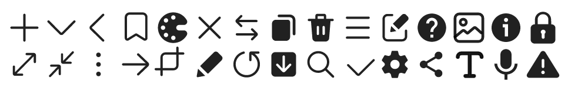

<h2 align="center">

[](https://mvnrepository.com/artifact/io.github.yanndroid/oneui)
[](https://github.com/Yanndroid/OneUI-Design-Library/commits/master)
[](https://github.com/Yanndroid/OneUI-Design-Library/issues)
[](https://github.com/Yanndroid/OneUI-Design-Library/pulls)
[](https://github.com/Yanndroid/OneUI-Design-Library/graphs/contributors)

</h2>
<p align="center">

</p>

:warning: If you are upgrading to v2.0.0, you might want to read this again because this is a huge update with a lot of changes and new stuff.

 A library for Android, useful for creating Samsung's OneUI styled apps. This library contains a theme which will apply for most views (see [which](#Progress)) in your layout, and some custom OneUI views. The text which is in the custom views is translated to 90 languages, so you don't need to worry for these. Android 5.0 (api 21) and above are supported, the library also has Dark mode, Landscape, Tablet, DeX and RTL support. This library has been tested in Android Studio, but should work in other IDEs too. You can download and install the latest version of the sample app either in my own [store](https://github.com/Yanndroid/YanndroidStore) or by downloading the apk [here](https://github.com/Yanndroid/OneUI-Design-Library/raw/master/app/release/app-release.apk). Suggestions, improvements and help are always welcome.

Huge thanks to [BlackMesa123](https://github.com/BlackMesa123) who has contributed a lot to this project.

Excuse my bad english, feel free to correct it. :)


- [Screenshots](#Screenshots)
- [Installation](#Installation)
- [Usage](#Usage)
- [Progress](#Progress)
- [Changelog](#Changelog)
- [More info](#More-info)
- [Special thanks](#Special-thanks-to)

## Screenshots

&nbsp;
&nbsp;


## Installation
v2.0.0 and future versions are (and only will be) available on mavenCentral. For older ones see below. (v1.3.0 was published to MavenCentral during development for testing purpose and should **not** be used as it's unstable and incomplete.)

1. Add the dependency to build.gradle (Module: ...)
```gradle
dependencies {
    implementation 'io.github.yanndroid:oneui:2.0.1'
    ...
}
```
2. Apply the main theme in AndroidManifest.xml
```xml
<application
    ...
    android:theme="@style/OneUITheme"
    >
    ...
</application>
```

<details>
<summary>If you're building apps specifically for Samsung devices, also check this out.</summary>

In order to enable even more UI elements, two flags can be used:
- In AndroidManifest.xml, add the following flags inside the "application" tag:
```xml
<application
    ...>
        <!-- enable Samsung UI elements -->
        <meta-data android:name="SamsungBasicInteraction" android:value="SEP10"/>
        <!-- disable icon squircle container -->
        <meta-data android:name="com.samsung.android.icon_container.has_icon_container" android:value="true"/>
        <!-- Samsung adaptive-icon (?) -->
        <meta-data android:name="com.samsung.android.icon_container.feature_appicon" android:value="ADAPTIVEICON_SHADOW"/>
        ...
</application>
```
- This one requires decompiling your app manually with [apktool](https://github.com/iBotPeaches/Apktool); replace manually the parent in ```Platform.V21.AppCompat``` and ```Platform.V25.AppCompat``` themes in the following files:
```
res/values/styles.xml
res/values-v25/styles.xml
```
...with ```Theme.DeviceDefault.NoActionBar```.

</details>


<details>
<summary>older versions</summary>

### with [Jitpack](https://jitpack.io/#Yanndroid/SamsungOneUi):
1. Add jitpack to build.gradle (Project: ...)
```gradle
allprojects {
    repositories {
        ...
        maven { url 'https://jitpack.io' }
	}
}
```
2. Add the dependency to build.gradle (Module: ...)
```gradle
dependencies {
    implementation 'com.github.Yanndroid:OneUI-Design-Library:1.3.0'
    ...
}
```
3. Apply the main theme in AndroidManifest.xml
```xml
<application
    ...
    android:theme="@style/SamsungTheme"
    >
    ...
</application>
```


### with Github Packages:
1. Create a [new token](https://github.com/settings/tokens) with ```read:packages``` permission.
2. Add the dependency to build.gradle (Module: ...)
```gradle
repositories {
    maven {
        url = uri("https://maven.pkg.github.com/Yanndroid/OneUI-Design-Library")
            credentials {
                username = "your username"
                password = "your token"
            }
    }
}


dependencies {
    implementation 'de.dlyt.yanndroid:oneui:1.3.0'
    ...
}
```

3. Apply the main theme in AndroidManifest.xml
```xml
<application
    ...
    android:theme="@style/SamsungTheme"
    >
    ...
</application>
```

</details>
<br/>

## Usage
In general, most of the views are styled automatically when you apply ```android:theme="@style/OneUITheme"``` in AndroidManifest.xml, the usage of the custom views in the library however is needed to achieve the best results.

- [DrawerLayout](#DrawerLayout)
- [ToolbarLayout](#ToolbarLayout)
- [SplashView](#SplashView)
- [AboutPage](#AboutPage)
- [SwitchBarLayout](#SwitchBarLayout)
- [CoordinatorLayout](#CoordinatorLayout)
- [Round Layouts](#Round-Layouts)
- [NestedScrollView](#NestedScrollView)
- [RecyclerView](#RecyclerView)
- [Button](#Button)
- [SeekBar](#SeekBar)
- [ProgressBar](#ProgressBar)
- [SwitchBar](#SwitchBar)
- [Spinner](#Spinner)
- [OptionButton](#OptionButton)
- [OptionGroup](#OptionGroup)
- [RelatedCard](#RelatedCard)
- [BottomNavigationView](#BottomNavigationView)
- [TabLayout](#TabLayout)
- [ViewPager](#ViewPager)
- [AlertDialog](#AlertDialog)
- [ProgressDialog](#ProgressDialog)
- [ClassicColorPickerDialog](#ClassicColorPickerDialog)
- [DetailedColorPickerDialog](#DetailedColorPickerDialog)
- [Preferences](#Preferences)
- [PopupMenu](#PopupMenu)
- [Tooltip](#Tooltip)
- [Snackbar](#Snackbar)
- [Advanced](#Advanced)
- [Icons](#Icons)
- [Color theme](#Color-theme)
  - [Entire App](#1-entire-App)
  - [Single/Multiple activities](#2-singleMultiple-activities)
  - [Via Code](#3-Via-Code)
- [App Icon](#App-Icon)

### DrawerLayout
"Ready-to-go" DrawerLayout with included Samsung's AppBar.


```xml
<de.dlyt.yanndroid.oneui.layout.DrawerLayout
    android:layout_width="match_parent"
    android:layout_height="match_parent"
    android:layout="..."
    app:drawer_icon="..."
    app:toolbar_title="..."
    app:toolbar_subtitle="..."
    app:toolbar_expanded="...">

</de.dlyt.yanndroid.oneui.layout.DrawerLayout>
```
The children of this view can be at three different location: on the **main screen**, in the **drawer** or in the **footer** (useful for views like BottomNavigationView). To specify the location of each child you can set the attribute ```app:layout_location``` of the child to either ```main_content``` (default), ```drawer_panel``` or ```footer```.

```app:toolbar_title``` and ```app:toolbar_subtitle``` can be used to set the title and subtitle of the AppBar and Toolbar. The AppBar status is set to expanded by default, you can simply set ```app:toolbar_expanded``` to false if you want it to be collapsed. On small screens/dpi the toolbar will not expand.

The drawable in ```app:drawer_icon="..."``` is the little icon in the header of the drawer panel. There are already some stock OneUI [icons](#Icons) included in the library you can use.

To make sure that AppBar scrolling behavior works correctly, the child set in ```main_content``` should either be [RecyclerView](#RecyclerView) or [NestedScrollView](#NestedScrollView) with ```app:layout_behavior``` set to ```@string/sesl_appbar_scrolling_view_behavior```. The stock RecyclerView and NestedScrollView might also work but probably won't behave correctly.

For further customization you can use ```android:layout``` to apply your own layout to this view, but keep in mind that you should add all the views and ids which are in the default layout, or your app might crash.
<br clear="left"/>

#### Methods
Return the [ToolbarLayout](#ToolbarLayout).
```java
public ToolbarLayout getToolbarLayout()
```
Set the icon of the DrawerButton.
```java
public void setDrawerButtonIcon(Drawable drawerIcon)
```
OnClickListener for the DrawerButton (the icon in the top right corner of the drawer panel).
```java
public void setDrawerButtonOnClickListener(OnClickListener listener)
```
Set the Tooltip text of the DrawerButton.
```java
public void setDrawerButtonTooltip(CharSequence tooltipText)
```
Set the title of the AppBar/Toolbar.
```java
public void setToolbarTitle(CharSequence title)
public void setToolbarTitle(CharSequence expandedTitle, CharSequence collapsedTitle)
```
Set the subtitle of the AppBar.
```java
public void setToolbarSubtitle(String subtitle)
```
Expand or collapse the AppBar with an optional animation.
```java
public void setToolbarExpanded(boolean expanded, boolean animate)
```
Show badges on the DrawerButton and NavigationIcon (use ```ToolbarLayout.N_BADGE``` and ```DrawerLayout.N_BADGE``` or either a number).
```java
public void setButtonBadges(int navigationIcon, int drawerIcon)
public void setDrawerButtonBadge(int count) //only the drawerButton
```
Open/close the drawer panel with an optional animation.
```java
public void setDrawerOpen(Boolean open, Boolean animate)
```

See [Advanced](#Advanced) for even more methods.

### ToolbarLayout
"Ready-to-go" Samsung's AppBar.


```xml
<de.dlyt.yanndroid.oneui.layout.ToolbarLayout
    android:layout_width="match_parent"
    android:layout_height="match_parent"
    android:layout="..."
    app:title="..."
    app:subtitle="..."
    app:expandable="..."
    app:expanded="..."
    app:navigationIcon="...">

</de.dlyt.yanndroid.oneui.layout.ToolbarLayout>
```
The children of this view can be at two different location: on the **main screen**, or in the **footer** (useful for views like BottomNavigationView). To specify the location of each child you can set the attribute ```app:layout_location``` of the child to either ```main_content``` (default), or ```footer```.

```app:title``` and ```app:subtitle``` can be used to set the title and subtitle of the AppBar and Toolbar. The AppBar status is set to expanded by default, you can simply set ```app:toolbar_expanded``` to false if you want it to be collapsed. You can also disable totally the CollapsingToolbar by setting ```app:toolbar_expandable``` to false. On small screens/dpi the toolbar will not expand.

The drawable in ```app:navigationIcon="..."``` is the icon for the Toolbar Navigation Button. There are already some stock OneUI [icons](#Icons) included in the library you can use.

To make sure that AppBar scrolling behavior works correctly, the child set in ```main_content``` should either be [RecyclerView](#RecyclerView) or [NestedScrollView](#NestedScrollView) with ```app:layout_behavior``` set to ```@string/sesl_appbar_scrolling_view_behavior```. The stock RecyclerView and NestedScrollView might also work but probably won't behave correctly.

For further customization you can use ```android:layout``` to apply your own layout to this view, but keep in mind that you should add all the views and ids which are in the default layout, or your app might crash.
<br clear="left"/>

#### Methods
Return the toolbar, useful for ```setSupportActionBar()```.
```java
public MaterialToolbar getToolbar()
```
Set the title of the AppBar/Toolbar.
```java
public void setTitle(CharSequence title)
public void setTitle(CharSequence expandedTitle, CharSequence collapsedTitle)
```
Set the subtitle of the AppBar.
```java
public void setSubtitle(CharSequence subtitle)
```
Expand or collapse the AppBar with an optional animation.
```java
public void setExpanded(boolean expanded, boolean animate)
```
Set the image of the NavigationButton.
```java
public void setNavigationButtonIcon(Drawable navigationIcon)
```
OnClickListener for the NavigationButton.
```java
public void setNavigationOnClickListener(OnClickListener listener)
```
Set the Tooltip of the NavigationButton.
```java
public void setNavigationButtonTooltip(CharSequence tooltipText)
```
Show a badge on the NavigationButton (use ```ToolbarLayout.N_BADGE``` or a number).
```java
public void setNavigationButtonBadge(int count)
```
Show/hide the NavigationButton.

```java
public void setNavigationButtonVisible(boolean visible)
```
Due to the poor customization of Contextual Menu's, the layout also offers a custom implementation for Toolbar buttons in order to match the OneUI aesthetics. If you want to, use these methods for creating MenuItems:
```java
// Button Icon resource id; Tooltip Text resource id; Button OnClickListener
public void addOverflowButton(int iconResId, int tooltipTextResId, View.OnClickListener listener)
// Use bigger button width; Button Icon resource id; Tooltip Text resource id; Button OnClickListener
public void addOverflowButton(boolean bigIcon, int iconResId, int tooltipTextResId, View.OnClickListener listener)
// get Button via view index (0: first one; 1: second one...)
public ToolbarImageButton getOverflowIcon(int index)
```
...and these to create the More Menu Button and its popup:
```java
// Popup items list; Items list OnClickListener
public void setMoreMenuButton(LinkedHashMap<String, Integer> linkedHashMap, AdapterView.OnItemClickListener ocl)
// Show Popup programmatically
public void showMoreMenuPopupWindow()
// Dismiss Popup programmatically
public void dismissMoreMenuPopupWindow()
```
```linkedHashMap``` is a list of name/badge pairs. Set the badge value to 0 if you don't want any, to ```ToolbarLayout.N_BADGE``` or to a number. You can find an example of it [here](https://github.com/Yanndroid/OneUI-Design-Library/blob/1e110958151a93647b71b80c68e54949a3a0691a/app/src/main/java/de/dlyt/yanndroid/oneuiexample/MainActivity.java#L345).

See [Advanced](#Advanced) for even more methods.

### SplashView
The activity you are gonna use for SplashView has a different style than the rest of the application, so you need to add this ```android:theme="@style/OneUISplashTheme"``` to your splash activity in AndroidManifest.

This view comes in two different configurations:  
1) An animated Splash Screen View like the one in the Galaxy Store.


```xml
<de.dlyt.yanndroid.oneui.layout.SplashView
    android:layout_width="match_parent"
    android:layout_height="match_parent"
    app:animated="true"
    app:text="..."
    app:background_image="..."
    app:foreground_image="..."
    app:animation="..." />
```

Set ```app:background_image``` to the background part of your icon and ```app:foreground_image``` to the foreground. The foreground image will have a customizable animation via the ```app:animation``` attr (default animation will be Galaxy Store one). ```app:text="..."``` is the text under the icon. It has a custom font to match the one on the Galaxy Store splash screen.
<br clear="left"/>

#### Methods
Sets the icon foreground and background
```java
public void setImage(Drawable foreground, Drawable background)
```
Sets the text of the Splash TextView
```java
public void setText(String mText)
```
Returns the text of the Splash TextView
```java
public String getText()
```
Starts the animation of the foreground
```java
public void startSplashAnimation()
```
Clears the animation
```java
public void clearSplashAnimation()
```
Listener for the Splash Animation
```java
public void setSplashAnimationListener(Animation.AnimationListener listener)
```

See [Advanced](#Advanced) for even more methods.

2) A simple Splash View without animation. (Samsung apps use their own ```com.samsung.android.startingwindow.LAYOUT_RESID_FOR_MASS``` flag in manifest)


```xml
<de.dlyt.yanndroid.oneui.layout.SplashView
    android:layout_width="match_parent"
    android:layout_height="match_parent"
    app:animated="false"
    app:text="..."
    app:image="..." />
```

Set the icon and text in ```app:image``` and ```app:text```.
<br clear="left"/>

#### Methods
Sets the icon Drawable
```java
public void setImage(Drawable mImage)
```
Sets the text of the Splash TextView
```java
public void setText(String mText)
```
Returns the text of the Splash TextView
```java
public String getText()
```

See [Advanced](#Advanced) for even more methods.

### AboutPage
A layout that looks like and has the same functions as the About Screen in any Samsung app. Like the [SplashView](#SplashView), the activity you're gonna use has a different style than the rest of the application, so you need to add this ```android:theme="@style/OneUIAboutTheme"``` to your About Activity in AndroidManifest.


```xml
<de.dlyt.yanndroid.oneui.layout.AboutPage
    android:layout_width="match_parent"
    android:layout_height="match_parent"
    app:optional_text="..."
    app:update_state="...">

    <com.google.android.material.button.MaterialButton
        style="@style/AboutPageButtonStyle"
        android:text="..." />

    ...

</de.dlyt.yanndroid.oneui.layout.AboutPage>
```

The App Name and Version are automatically added to the view. The Info Button at the top right will redirect the user to the App Info in System Settings. ```app:optional_text``` is the text that can be added between the version and the status text. The status text will change according to the state you have set to the view programmatically (see below) ,or in the layout with ```app:update_state```.

You can use ```style="@style/AboutPageButtonStyle"``` for the buttons, which are shown at the bottom.
<br clear="left"/>

#### Methods
Set the update state of the view to either ```AboutPage.LOADING```, ```AboutPage.NO_UPDATE```, ```AboutPage.UPDATE_AVAILABLE```, ```AboutPage.NOT_UPDATEABLE``` or ```AboutPage.NO_CONNECTION```. This will change the visibility of certain views and the status text.
```java
public void setUpdateState(@UpdateState int state)
```
Set the optional text between the version and the status text.
```java
public void setOptionalText(String text)
```
OnClickListener for the update and retry button.
```java
public void setUpdateButtonOnClickListener(OnClickListener listener)
public void setRetryButtonOnClickListener(OnClickListener listener)
```

See [Advanced](#Advanced) for even more methods.

### SwitchBarLayout
This is a extended [ToolbarLayout](#ToolbarLayout) with [SwitchBar](#SwitchBar). Useful for creating inner preferences layouts in pair with [SwitchPreferenceScreen](#SwitchPreferenceScreen).


```xml
<de.dlyt.yanndroid.oneui.layout.SwitchBarLayout
    android:layout_width="match_parent"
    android:layout_height="match_parent"
    android:layout="..."
    app:toolbar_title="..."
    app:toolbar_subtitle="..."
    app:toolbar_expanded="...">

</de.dlyt.yanndroid.oneui.layout.SwitchBarLayout>
```

Manage the Toolbar with ```app:toolbar_title```, ```app:toolbar_subtitle``` and ```app:toolbar_expanded```.

For further customization you can use ```android:layout``` to apply your own layout to this view, but keep in mind that you should add all the views and ids which are in the default layout, or your app might crash.
<br clear="left"/>

#### Methods
Return the [SwitchBar](#SwitchBar).
```java
public SwitchBar getSwitchBar()
```
Set the Toolbar title and subtitle.
```java
public void setToolbarTitle(CharSequence title)
public void setToolbarTitle(CharSequence expandedTitle, CharSequence collapsedTitle)
public void setToolbarSubtitle(String subtitle)
```
Expand or collapse the toolbar with an optional animation.
```java
public void setToolbarExpanded(boolean expanded, boolean animate)
```

See [Advanced](#Advanced) for even more methods.

### CoordinatorLayout
Samsung's CoordinatorLayout
```xml
<de.dlyt.yanndroid.oneui.layout.CoordinatorLayout
    android:layout_width="match_parent"
    android:layout_height="match_parent">

</de.dlyt.yanndroid.oneui.layout.CoordinatorLayout>
```

### Round Layouts
LinearLayout, FrameLayout and [NestedScrollView](#NestedScrollView) with rounded corners. Usage is the same as their parents view.
```xml
<de.dlyt.yanndroid.oneui.layout.RoundLinearLayout
    android:layout_width="match_parent"
    android:layout_height="match_parent"
    app:roundedCorners="...">

</de.dlyt.yanndroid.oneui.layout.RoundLinearLayout>

<de.dlyt.yanndroid.oneui.layout.RoundFrameLayout
    android:layout_width="match_parent"
    android:layout_height="match_parent"
    app:roundedCorners="...">

</de.dlyt.yanndroid.oneui.layout.RoundFrameLayout>

<de.dlyt.yanndroid.oneui.view.RoundNestedScrollView
    android:layout_width="match_parent"
    android:layout_height="match_parent"
    app:roundedCorners="...">

</de.dlyt.yanndroid.oneui.view.RoundNestedScrollView>
```
To choose which corners are rounded use ```app:roundedCorners```. Available are ```all``` (default), ```none```, ```bottom_left```, ```bottom_right```, ```top_left``` and ```top_right``` (you can separate them with "|", to use multiple). Note that [DrawerLayout](#DrawerLayout), [ToolbarLayout](#ToolbarLayout) and [SwitchBarLayout](#SwitchBarLayout) already have rounded corners on their main content.

### NestedScrollView
Samsung's NestedScrollView, see [Round Layouts](#Round-Layouts) for the rounded corner version.

```xml
<de.dlyt.yanndroid.oneui.view.NestedScrollView
    android:layout_width="match_parent"
    android:layout_height="match_parent">

</de.dlyt.yanndroid.oneui.view.NestedScrollView>
```

If you want to use this as child for [DrawerLayout](#DrawerLayout) or [ToolbarLayout](#ToolbarLayout), don't forget to add ```app:layout_behavior="@string/sesl_appbar_scrolling_view_behavior"```.

### RecyclerView
Samsung's RecyclerView, heavily used in their apps.

```xml
<de.dlyt.yanndroid.oneui.view.RecyclerView
    android:layout_width="match_parent"
    android:layout_height="match_parent">
        
</de.dlyt.yanndroid.oneui.view.RecyclerView>
```
Attributes and usage are the same as Google's [RecyclerView](https://developer.android.com/reference/androidx/recyclerview/widget/RecyclerView).

#### Methods
Enable Samsung's FastScroller. 
```java
public void seslSetFastScrollerEnabled(boolean enabled)
public void seslSetFastScrollerEventListener(RecyclerView.SeslFastScrollerEventListener listener)
```
Enable Samsung's Go To Top button. 
```java
public void seslSetGoToTopEnabled(boolean enabled)
public void seslSetGoToTopBottomPadding(int padding)
public void seslSetOnGoToTopClickListener(RecyclerView.SeslOnGoToTopClickListener listener)
```
Round the corners of the last item.
```java
public void seslSetLastRoundedCorner(boolean enabled)
```
Fill the background at the bottom after the last item with the app background color.
```java
public void seslSetFillBottomEnabled(boolean enabled)
public void seslSetFillBottomColor(int color)
```

Samsung also customized RecyclerView.ItemDecoration class by adding a call to **onDispatchDraw** method of the View. Overriding the ```seslOnDispatchDraw``` method lets you customize even more your list/grid view. You can find an example of it [here](https://github.com/Yanndroid/OneUI-Design-Library/blob/1e110958151a93647b71b80c68e54949a3a0691a/app/src/main/java/de/dlyt/yanndroid/oneuiexample/tabs/IconsTab.java#L298).

### Button
The Button has three styles which you can use, depending on your needs.


```@style/ButtonStyle.Transparent```  
```@style/ButtonStyle.Invert``` 
```@style/ButtonStyle.Invert.Secondary```

(There are also ```AboutPageButtonStyle``` and ```AboutPageButtonStyle.Update``` for the [AboutPage](#AboutPage), you can also use them.)

### SeekBar
Samsung's SeekBar.


```xml
<de.dlyt.yanndroid.oneui.SeekBar
    android:layout_width="match_parent"
    android:layout_height="wrap_content"
    app:seslSeekBarMode="expand" />
```
With the ```app:seslSeekBarMode``` attribute, you can set the behavior of the SeekBar when pressed/tracking (suggested values are ```standard``` or ```expand```). 

#### Methods
Set a warning at progress i.
```java
public void setOverlapPointForDualColor(int i)
```
Other methods are the same as the default [Seekbar](https://developer.android.com/reference/android/widget/SeekBar).

### ProgressBar


```@style/ProgressBarStyle.Horizontal```  
```@style/ProgressBarStyle.Horizontal.Large```  
```@style/ProgressBarStyle.Circle.Large```  
```@style/ProgressBarStyle.Circle```  
```@style/ProgressBarStyle.Circle.Small```  
```@style/ProgressBarStyle.Circle.Title```

### SwitchBar
Samsung's SwitchBar, same as the one you find in OneUI System Settings app.


```xml
<de.dlyt.yanndroid.oneui.SwitchBar
    android:layout_width="match_parent"
    android:layout_height="wrap_content" />
```

There is also the [SwitchBarLayout](#SwitchBarLayout) if you need. 

#### Methods
On and Off text resource id for the SwitchBar (default will be "On" and "Off").
```java
public void setSwitchBarText(int i, int i2)
```
Enable/disable the SwitchBar.
```java
public void setEnabled(boolean z)
```
Visibility of the ProgressBar in the SwitchBar.
```java
public void setProgressBarVisible(boolean z)
```
SwitchBar Listener.
```java
public void addOnSwitchChangeListener(OnSwitchChangeListener onSwitchChangeListener)
```

### Spinner

Spinner with rounded corners and custom selector.


```xml
<androidx.appcompat.widget.SeslSpinner
    android:layout_width="match_parent"
    android:layout_height="wrap_content" />
```

Same usage as [Spinner](https://developer.android.com/reference/android/widget/Spinner).

### OptionButton
Create lists inside DrawerLayout without using RecyclerView with OptionButton.


```xml
<de.dlyt.yanndroid.oneui.drawer.OptionButton
    android:layout_width="match_parent"
    android:layout_height="wrap_content"
    app:icon="..."
    app:text="..."
    app:selected="..."
    app:counter="..."
    app:counterEnabled="..." />
```

```app:icon="..."``` attribute is the button icon, and ```app:text="..."``` the text. ```app:selected="..."``` is to show the OptionButton as selected (colored and bold text), it's false by default. ```app:counterEnabled="..."``` and ```app:counter="..."``` can customize a counter at the end of the view, which is disabled by default. Make sure to enable the ```app:counterEnabled``` attribute or it won't show up.

#### Methods
Set/get the icon and text.
```java
public void setIcon(Drawable icon)
public String getText()
public void setText(String text)
```
Manage the counter.
```java
public Integer getCounter()
public void setCounter(Integer integer)
public void setCounterEnabled(Boolean enabled)
public void toggleCounterEnabled()
public Boolean isCounterEnabled()
```
Control the state (colored, bold text).
```java
public void setButtonSelected(Boolean selected)
public void toggleButtonSelected()
public Boolean isButtonSelcted()
```
Enable/disable the OptionButton.
```java
public void setButtonEnabled(Boolean enabled)
```

### OptionGroup
[OptionButton](#OptionButton) and OptionGroup are working together like [RadioButton](https://developer.android.com/reference/android/widget/RadioButton) and [RadioGroup](https://developer.android.com/reference/android/widget/RadioGroup). It will select an OptionButton on click.


```xml
<de.dlyt.yanndroid.oneui.drawer.OptionGroup
    android:layout_width="match_parent"
    android:layout_height="wrap_content"
    app:selectedOptionButton="...">

    <de.dlyt.yanndroid.oneui.drawer.OptionButton
        android:layout_width="match_parent"
        android:layout_height="wrap_content"
        app:icon="..."
        app:text="..." />

    ...

</de.dlyt.yanndroid.oneui.drawer.OptionGroup>
```

```app:selectedOptionButton="..."``` will set the default selected OptionButton with this id. This view can also have other children, for example a divider:


```xml
<View style="@style/DrawerDividerStyle" />
```


#### Methods
Select an OptionButton with either the view, id or position.
```java
public void setSelectedOptionButton(OptionButton optionButton)
public void setSelectedOptionButton(Integer id)
public void setSelectedOptionButton(int position)
```
Get the currently selected OptionButton.
```java
public OptionButton getSelectedOptionButton()
```
Listener which will provide you view, id and position of the clicked OptionButton.
```java
public void setOnOptionButtonClickListener(OnOptionButtonClickListener listener)
```

### RelatedCard
Samsung's "Looking for something else?" Card you find in System Settings app.

  

(Depending on your screen right now you might not see it, but there's actually a light blue card around it.)

```xml
<de.dlyt.yanndroid.oneui.RelatedCard
    android:layout_width="match_parent"
    android:layout_height="wrap_content"
    app:title="...">

    <com.google.android.material.textview.MaterialTextView
        style="@style/RelatedButtonStyle"
        android:text="..." />


</de.dlyt.yanndroid.oneui.RelatedCard>
```
You can simply use ```style="@style/RelatedButtonStyle"``` for the child TextViews.

#### Methods
Get/set the title text.
```java
public String getTitle()
public void setTitle(String title)
```

### BottomNavigationView
Samsung's BottomNavigationView.


```xml
<de.dlyt.yanndroid.oneui.view.BottomNavigationView
    android:layout_width="match_parent"
    android:layout_height="wrap_content">
        
</de.dlyt.yanndroid.oneui.view.BottomNavigationView>
```

If you want to set it up with a ViewPager you'll have to use the [ViewPager](#ViewPager) bundled in the library, the usage is the same as Google's [TabLayout](https://developer.android.com/reference/com/google/android/material/tabs/TabLayout), but you'll have to call ```updateWidget(Activity activity)``` after you configurated it.

#### Methods
Add a custom ImageButton (like in Samsung's Gallery).
```java
public void addTabCustomButton(Drawable icon, CustomButtonClickListener listener)
```

### TabLayout
Samsung's TabLayout.


```xml
<de.dlyt.yanndroid.oneui.view.TabLayout
    android:layout_width="match_parent"
    android:layout_height="wrap_content">
        
</de.dlyt.yanndroid.oneui.view.TabLayout>
```

If you want to set it up with a ViewPager you'll have to use the [ViewPager](#ViewPager) bundled in the library, the usage is the same as Google's [TabLayout](https://developer.android.com/reference/com/google/android/material/tabs/TabLayout), but you'll have to call ```updateWidget()``` after you configurated it. 

### ViewPager
ViewPager working with [BottomNavigationView](#BottomNavigationView) and [TabLayout](#TabLayout).

```xml
<androidx.viewpager.widget.SeslViewPager
    android:layout_width="match_parent"
    android:layout_height="match_parent">

</androidx.viewpager.widget.SeslViewPager>
```

The Adapter for this ViewPager has to extend [androidx.fragment.app.FragmentPagerAdapter](https://developer.android.com/reference/androidx/fragment/app/FragmentPagerAdapter).

### AlertDialog
Samsung's AlertDialogs.

&nbsp;
&nbsp;


Usage is the same as the default [AlertDialog](https://developer.android.com/reference/android/app/AlertDialog), but you have to use ```de.dlyt.yanndroid.oneui.dialog.AlertDialog``` instead.

### ProgressDialog
Samsung's Alert Dialog with Progress.

&nbsp;


Usage is the same as [AlertDialog](#AlertDialog) but with additional methods.

#### Methods
Get/set the Progress drawables.
```java
public void setProgressDrawable(Drawable d)
public void setIndeterminateDrawable(Drawable d)
```

Get/set Progress indeterminate status.
```java
public boolean isIndeterminate()
public void setIndeterminate(boolean indeterminate)
```

Get/set Progress Style. Value can either be ```STYLE_SPINNER```, ```STYLE_HORIZONTAL``` or ```STYLE_CIRCLE_ONLY```.
```java
public void setProgressStyle(int style)
```

Get/set ProgressBar progress (in case you're using ```STYLE_HORIZONTAL```).
```java
public int getProgress()
public void setProgress(int value)
public int getSecondaryProgress()
public void setSecondaryProgress(int secondaryProgress)
public int getMax()
public void setMax(int max)
public void incrementProgressBy(int diff)
public void incrementSecondaryProgressBy(int diff)
public void setProgressNumberFormat(String format)
public void setProgressPercentFormat(NumberFormat format)
```

### ClassicColorPickerDialog
Samsung's Sesl Color Picker Dialog.


Create the dialog with ColorPickerChangedListener, starting color, and recent colors.
```java
public ClassicColorPickerDialog(Context context, ClassicColorPickerDialog.ColorPickerChangedListener listener)
public ClassicColorPickerDialog(Context context, ClassicColorPickerDialog.ColorPickerChangedListener listener, int currentColor)
public ClassicColorPickerDialog(Context context, ClassicColorPickerDialog.ColorPickerChangedListener listener, int currentColor, int[] recentColors)
public ClassicColorPickerDialog(Context context, ClassicColorPickerDialog.ColorPickerChangedListener listener, int[] recentColors)
```
Set the current color.
```java
public void setNewColor(Integer color)
```
Show/hide the color transparency SeekBar.
```java
public void setTransparencyControlEnabled(boolean var1)
```
Show the dialog.
```java
public void show()
```
Dismiss the dialog.
```java
public void dismiss()
```
Close the dialog.
```java
public void close()
```
Example:
```java
ClassicColorPickerDialog mColorPickerDialog = new ClassicColorPickerDialog(this,
        new ClassicColorPickerDialog.ColorPickerChangedListener() {
            @Override
            public void onColorChanged(int i) {
                
            }
        },
        color);
mColorPickerDialog.show();
```

### DetailedColorPickerDialog
Samsung Notes app Color Picker Dialog, in case you need a more complete one.

&nbsp;


Create the dialog with mode (1 = Spectrum, 2 = Swatches) and fArr (starting color).
```java
public DetailedColorPickerDialog(Context context, int mode, float[] fArr)
public DetailedColorPickerDialog(Context context, float[] fArr)
```
Set the Color Change Listener.
```java
public void setColorPickerChangeListener(ColorPickerChangedListener colorPickerChangedListener)
```
Show the dialog.
```java
public void show()
```
Dismiss the dialog.
```java
public void dismiss()
```
Close the dialog.
```java
public void close()
```
Example:
```java
float[] scolor = new float[3];
Color.colorToHSV(Color.parseColor("#0381fe5"), scolor);

DetailedColorPickerDialog mColorPickerDialog = new DetailedColorPickerDialog(this, scolor);
mColorPickerDialog.setColorPickerChangeListener(new DetailedColorPickerDialog.ColorPickerChangedListener() {
    @Override
    public void onColorChanged(int i, float[] fArr) {
        
    }

    @Override
    public void onViewModeChanged(int i) {

    }
});
mColorPickerDialog.show();
```

### Preferences
Samsung's Preferences.

Attributes and usage are the same as Google's [PreferenceFragmentCompat](https://developer.android.com/reference/androidx/preference/PreferenceFragmentCompat) but you have to use ```de.dlyt.yanndroid.oneui.layout.PreferenceFragment``` instead. All the default preferences in androidx.preference are already included.

#### Methods
Enable/disable rounded corners.
```java
public void seslSetRoundedCorner(boolean enabled)
```
Create and add a [RelatedCard](#RelatedCard) to the bottom of the Preferences.
```java
PreferencesRelatedCard relatedCard = createRelatedCard(context);
relatedCard.addButton("This", this)
            .addButton("That", this)
            .addButton("There", this)
            .show(this);
```

##### Custom Preferences:

#### SwitchPreferenceScreen


Clickable SwitchPreference used to contain inner preferences, can be used in combination with [SwitchBarLayout](#SwitchBarLayout).

```xml
<SwitchPreferenceScreen
    android:key="..."
    android:summary="..."
    android:title="..."/>
```

Both ```OnPreferenceClickListener``` and ```intent``` tag can be used to manage the behavior of the Preference when clicked.

#### TipsCard


```xml
<TipsCardViewPreference
    android:key="..."
    android:summary="..."
    android:title="..." />
```

#### ColorPickerPreference

&nbsp;
&nbsp;


```xml
<ColorPickerPreference
    android:defaultValue="..."
    android:key="..."
    android:title="..."
    app:pickerType="..."
    app:showAlphaSlider="..." />
```

```android:defaultValue```: default color string (ex. #FF2525)  
```app:pickerType```: classic or detailed  
```app:showAlphaSlider```: show transparency seekbar in classic picker type

#### HorizontalRadioPreference
Samsung's Radio Preferences used in Light/Dark mode Settings and Resolution Settings.


```xml
<HorizontalRadioPreference
    android:key="..."
    android:title="..."
    app:entriesImage="..."
    app:entries="..."
    app:entriesSubtitle="..."
    app:entryValues="..."
    app:viewType="..." />
```

```app:entriesImage```: array with drawables (to be used only with **image** viewType)  
```app:entries```: string array for the names  
```app:entriesSubtitle```: string array for the subtitle (to be used only with **noImage** viewType) 
```app:entriesValues```: string array for the values  
```app:viewType```: image or noImage


### PopupMenu


Create a PopupMenu.
```java
//de.dlyt.yanndroid.oneui.view.PopupMenu
PopupMenu popupMenu = new PopupMenu(view);
```
Inflate a list of the items to show.
```java
public void inflate(ArrayList<String> menu)
```
Set the click listener.
```java
public void setOnMenuItemClickListener(AdapterView.OnItemClickListener listener)
```
Show and dismiss the popup.
```java
public void show()
public void show(int xoff, int yoff) //with offset
public void dismiss()
```

### Tooltip
Samsung's Tooltip.


Usage is the same as [TooltipCompat](https://developer.android.com/reference/androidx/appcompat/widget/TooltipCompat) but with additional methods. Please note this won't show up on default views and has to be added manually instead of using ```view.setTooltipText(text)```:
```java
Tooltip.setTooltipText(view, text);
SeslViewReflector.semSetHoverPopupType(view, 1 /* SemHoverPopupWindow.TYPE_TOOLTIP */);
```

#### Methods
```java
public static void seslSetTooltipForceActionBarPosX(boolean z)
public static void seslSetTooltipForceBelow(boolean z)
public static void seslSetTooltipNull(boolean z)
public static void seslSetTooltipPosition(int x, int y, int direction)
public void showPenPointEffect(MotionEvent event, boolean more)
```


### Snackbar
Samsung's Snackbar.


Same usage as the default [Snackbar](https://developer.android.com/reference/com/google/android/material/snackbar/Snackbar):
```java
//de.dlyt.yanndroid.oneui.view.Snackbar

Snackbar.make(view, "Text label", Snackbar.LENGTH_SHORT).setAction("Action", new View.OnClickListener() {
    @Override
    public void onClick(View v) {
        //onClick
    }
}).show();
```

### Advanced
This is for advanced usage only. I've added the method ```getView(int view)``` to some of the custom views to access the views inside it and change them directly. This can be helpful if you want to do something which isn't implemented in the custom views yet as I can't think of all possible uses. Currently this method is available in DrawerLayout, ToolbarLayout, SplashView, AboutPage and SwitchBarLayout.

### Icons
There are also some of the stock icons you can find in Samsung apps included in this library, and we will add more over time. You can use them with ```@drawable/ic_samsung_...``` and ```R.drawable.ic_samsung_...```.



*not all icons are shown here because there are too much now (186). They are all listed with the name in the icon tab of the sample app.

### Color theme
The default color of the style is the same blue as Samsung (see [Screenshots](#Screenshots)). But like Samsung has different colors for different apps, you too can use other colors which will apply on the entire App and even on the [App Icon](#App-Icon). In this library there are three different ways to do that and all three can be used simultaneously:

#### 1. Entire App
This methode will apply the color theme on the entire app and on the app icon. You need to add these three colors in your ```colors.xml``` :
```xml
<color name="primary_color">...</color>
<color name="secondary_color">...</color>
<color name="primary_dark_color">...</color>
```
These colors should have approximately the same color but with a different brightness. ```secondary_color``` the brightest, then ```primary_color``` and the darkest ```primary_dark_color```.  

Here are some presets (if you want I can make more):
-  Yellow like MyFiles App (also used in [FreshHub](https://github.com/Yanndroid/FreshHub)):
```xml
<color name="primary_color">#fff3a425</color>
<color name="secondary_color">#ffffb949</color>
<color name="primary_dark_color">#ffbd7800</color>
```

-  Dark green like Calendar App:
```xml
<color name="primary_color">#ff008577</color>
<color name="secondary_color">#ff009e7c</color>
<color name="primary_dark_color">#ff00574b</color>
```

-  Light green like Calculator App:
```xml
<color name="primary_color">#ff68b31a</color>
<color name="secondary_color">#ff7fa87f</color>
<color name="primary_dark_color">#ff569415</color>
```

-  Light red which I personally like:
```xml
<color name="primary_color">#ffff034a</color>
<color name="secondary_color">#ffff3d67</color>
<color name="primary_dark_color">#ffde0043</color>
```

#### 2. Single/Multiple activities
If you want to use different colors for a single (or multiple, but not all) activities, this is also possible. The difference here is that this will only apply for the activities you want. Add the three colors (see [Entire App](#1.-Entire-App)) in a theme in ```themes.xml```:

```xml
<style name="ThemeName" parent="OneUITheme">
    <item name="colorPrimary">#fff3a425</item>
    <item name="colorSecondary">#ffffb949</item>
    <item name="colorPrimaryDark">#ffbd7800</item>
</style>
```
Then apply it on the activities you want with ```android:theme="@style/ThemeName"``` in ```AndroidManifest.xml```.

#### 3. Via Code
This method allows you to change the color of your theme dynamically within your app. It's based on [this idea](https://stackoverflow.com/a/48517223). In your activity onCreate add this line at the top **before** ```super.onCreate(...)```:
```java
new ThemeColor(this);
```
This will apply the color theme at launch. If you want to change the color you can use these functions:
```java
ThemeColor.setColor(Activity activity, int red, int green, int blue)
ThemeColor.setColor(Activity activity, float red, float green, float blue)
ThemeColor.setColor(Activity activity, float[] hsv)
```
The color you apply with these functions will apply on every activity with ```new ThemeColor(this)``` at the top. You can also enable/disable Dark theme programmatically:
```java
// mode: DARK_MODE_AUTO; DARK_MODE_DISABLED; DARK_MODE_ENABLED
ThemeColor.setDarkMode(AppCompatActivity activity, int mode)
```

### App Icon
The most app icons of Samsung apps are made of one solid color as background and a white icon as foreground. Sometimes there is even a little detail of the foreground with a similar color as the background.

&nbsp;

&nbsp;

&nbsp;
&nbsp;
&nbsp;

 I would suggest you to use ```@color/primary_color``` for the background color and either ```@color/launcher_foreground_detail_color``` , ```@color/secondary_color``` or ```@color/primary_dark_color``` for the foreground "detail" color, so [your color theme](#Color-theme) applies for the app icon too.  
My sample app icon for example:


## Progress

- [x] CardView
- [x] CheckBox
- [x] Button
- [x] Switch 
- [x] RadioButton
- [x] ProgressBar
- [x] SeekBar
- [x] SwitchBar
- [x] RelatedCard
- [x] ScrollBar & FastScroll
- [x] PopupMenu
- [x] Dialog
- [x] TabLayout & ViewPager
- [x] Preferences
- [x] Tooltip
- [x] BottomNavigationView
- [x] About Screen
- [x] Splash Screen
- [x] AppBarLayout
- [x] DrawerLayout
- [x] Drawer Divider
- [x] SnackBar
- [x] Color Picker Dialog
- [x] Spinner
- [ ] SearchView
- [ ] BottomSheet

*needs improvement

## Changelog

<details>
<summary>2.0.1</summary>

- fixed:
    - scroll bevavior on clickable views
    - aboutpage button font and ripple 
    - popupmenu going beyond screen
    - drawerLayout back click closes drawer
    - crash on small screens/dpi
- icons++
- Spinner
- BottomNavigationView improvements

</details>

<details>
<summary>2.0.0</summary>

- contributions from BlackMesa123:
    - AppBarLayout (& friends)
    - Preferences
    - Classic Color Picker
    - Dialogs
    - Tooltip
    - TabLayout
    - BottomNavigationView
    - Layouts rework
    - NestedScrollView, RecyclerView, Round Layouts
    - and much more (most of the stuff in this release)
- a lot of fixes and improvements
- support for api 21> (needs to be tested)
- Snackbar & PopupMenu
- more icons
- now available on mavencentral

</details>

<details>
<summary>1.3.0</summary>

- renamed library
- getView methode added
- splash screen display size fix
- minor changes

</details>

<details>
<summary>1.2.2</summary>

- Scrollbar
- AboutPage
- RelatedCard
- corner fix
- language update
- customizable splash animation
- expanded attribute for toolbar
- fixed landscape toolbar height
- improved orientation switching
- button text fix
- status & navigation bar dim on drawer slide
- added changelog to readme

</details>

<details>
<summary>1.2.1</summary>

- landscape support
- tablet support
- dex support
- expandable attribute for toolbar
- toolbar subtitle color
- added Header style

</details>

<details>
<summary>1.2.0</summary>

- colorPicker
- color Changer
- readme finished
- much more icons
- rtl support
- translated to 90 languages

</details>

<details>
<summary>1.1.3 - 1.0.0</summary>

- initial release/publish
- most of the stuff (I don't remember anymore...)

</details>
<br/>

## More info
- [Official OneUI Design Guide](https://design.samsung.com/global/contents/one-ui/download/oneui_design_guide_eng.pdf)

## Special thanks to:
- [BlackMesa123](https://github.com/BlackMesa123) for a lot of OneUI stuff, more compatibility and his experience.
- [TenSeventy7](https://github.com/TenSeventy7) for some stuff and help.
- [leonbcode](https://github.com/leonbcode) for github actions, so this library is always up-to-date.
- [AlirezaIvaz](https://github.com/AlirezaIvaz) for translation correction (Persian) and issue reporting.
- [nfauv2001](https://github.com/nfauv2001) for helping me out with my english.
- [Samsung](https://www.samsung.com/) for the OneUI Design.
